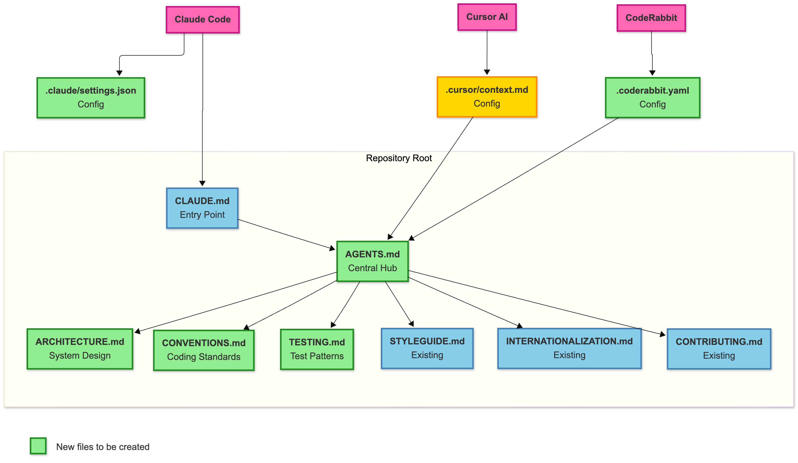

# Proposed Directory Structure for AI Context & Configuration

**Purpose**: Establish modular AI documentation and Claude Code configuration
**Date**: 2025-12-02
**Status**: Awaiting team approval

---

## Summary of Changes

### What's Being Added
- ✅ **AGENTS.md** - Central AI documentation hub - https://agents.md https://github.com/openai/agents.md
- ✅ **ARCHITECTURE.md** - System architecture, Plugin SDK, tech stack
- ✅ **CONVENTIONS.md** - Coding standards, Proper patterns and things to avoid, etc. ("See STYLEGUIDE.md for base rules. This document provides AI-specific...")
- ✅ **TESTING.md** - All testing (unit, integration, E2E)
- ✅ **.claude/settings.json** - Team Claude Code configuration
- ✅ **.coderabbit.yaml** - Team coderabbit configuration

### What's Being Updated
- 🔄 **CLAUDE.md** - Update to reference AGENTS.md
- 🔄 **.cursor/context.md** - Update to reference AGENTS.md

### What's Being Removed
- ❌ **.ai/context.md** - Content merged into new modular files
- ❌ **.ai/README.md** - The AGENTS.md at the root acts as a README for AI

---

## Current Structure

```
console/
├── CLAUDE.md                          # Claude Code entry, references .ai/context.md
├── .ai/
│   ├── context.md                     # Single monolithic file (will be deleted)
│   └── README.md
├── .claude/
│   └── commands/                      # Team commands
├── README.md
├── CONTRIBUTING.md
├── STYLEGUIDE.md
└── INTERNATIONALIZATION.md
```

**Issues with Current Structure**:
- ❌ No team `.claude/settings.json` (causes "create settings.json" suggestions)
- ❌ Monolithic `.ai/context.md` (hard to maintain, update specific sections)
- ❌ No central AI documentation hub
- ❌ Mixed concerns in single file

---

## Proposed Structure

```
console/
├── AGENTS.md                           # ✅ NEW - Central AI hub
├── CLAUDE.md                           # 🔄 UPDATED - Points to AGENTS.md
├── ARCHITECTURE.md                     # ✅ NEW - System arch, Plugin SDK, tech stack
├── CONVENTIONS.md                      # ✅ NEW - Coding standards, patterns, etc. (References STYLEGUIDE.md)
├── TESTING.md                          # ✅ NEW - All testing approaches
├── .ai/                                # ❌ REMOVED 
│   ├──[context.md deleted]             # ❌ REMOVED - Content merged into ARCHITECTURE, CONVENTIONS, TESTING
│   ├──[README.md deleted]              # ❌ Replaced by AGENTS.md
├── .claude/                            # Claude Code
│   ├── settings.json                   # ✅ NEW - Team **configurations**
│   └── commands/                       # Team commands
├── .cursor/                            # ✔️ EXISTS - Cursor-specific configs
│   └── context.md                      # 🔄 UPDATED - Points to AGENTS.md
├── README.md                           # ✔️ UNCHANGED
├── CONTRIBUTING.md                     # ✔️ UNCHANGED
├── STYLEGUIDE.md                       # ✔️ UNCHANGED
├── INTERNATIONALIZATION.md             # ✔️ UNCHANGED
└── coderabbit.yaml                     # ✅ NEW - Custom configurations and references new and existing files
 

Legend:
  ✅ NEW - File to be created
  🔄 UPDATED - File to be modified
  ❌ REMOVED - File to be deleted
  ✔️ UNCHANGED - File stays as-is
```

---

## Flow Diagram



---

## File Purposes & Sizes

### Root Level

| File | Purpose | Audience | Checked In |
|------|---------|----------|------------|
| **AGENTS.md** | Central AI documentation hub, Acts as README for AI, quick start | All AI tools | ✅ Yes |
| **CLAUDE.md** | Claude Code entry point → AGENTS.md | Claude Code | ✅ Yes |
| **ARCHITECTURE.md** | System architecture, Plugin SDK, tech stack, monorepo | All AI tools | ✅ Yes |
| **CONVENTIONS.md** | Coding standards, P0/P1 patterns, file naming | All AI tools | ✅ Yes |
| **TESTING.md** | Unit, integration, E2E testing patterns | All AI tools | ✅ Yes |

### .claude/ Directory (Claude Code Configuration)

| File | Purpose | Checked In |
|------|---------|------------|
| **settings.json** | Team permissions, hooks | ✅ Yes |
| **commands/** | Shared slash commands | ✅ Yes |

---

## Content Distribution

### ARCHITECTURE.md
**Contains:**
- Monorepo package structure (frontend/, pkg/, cmd/)
- Technology stack overview:
  - Frontend: React, TypeScript, yarn workspaces, Webpack Module Federation
  - Backend: Go, klog, Kubernetes client libraries
  - Deployment: OpenShift/Kubernetes
  - Build tools: yarn, Go toolchain
- Console Dynamic Plugin SDK architecture
  - Extension points system (25+ types)
  - Module Federation runtime loading
  - Type system and code references
  - Public API surface (re-exports from @console/shared, @console/internal, etc.)
- Plugin structure patterns
- Key architectural decisions
- Package relationships and dependencies

### CONVENTIONS.md
**Contains:**
- TypeScript/React conventions
  - Functional components and hooks
  - State management patterns (Context API, migrating from Redux)
  - Component structure and file organization
- Framework usage patterns:
  - PatternFly design system usage
  - React hooks best practices (useK8sWatchResource, etc.)
  - i18n with useTranslation hook
- Go best practices
  - Package organization patterns
  - Error handling standards
  - Logging conventions (klog)
  - HTTP handler patterns
- File naming conventions (PascalCase, kebab-case rules)
- API call patterns (consoleFetchJSON, k8s resource hooks)
- Styling conventions (SCSS modules, PatternFly integration)
- Error handling patterns
- P0/P1 review patterns

### TESTING.md
**Contains:**
- Unit testing patterns (Jest)
- Integration testing approaches
- React Testing Library best practices
- E2E testing (Cypress)
- Test organization and structure
- Coverage expectations
- Testing best practices

---

## How It Works

### Session Loading Order

When Claude Code starts a session:

1. **CLAUDE.md** → Points to AGENTS.md
2. **settings.json** → Is automatically discovered and loads without any mention in CLAUDE.md
3. **settings.local.json** → Loads personal workflow (if configured)

### Team vs Personal Separation

**Team Configuration**:
- `.claude/settings.json` - Team permissions and hooks
- `.claude/commands/` - Shared slash commands
- `AGENTS.md` - Central hub for AI coding agents

**Personal Configuration** (gitignored, individual developers):
- `.claude/settings.local.json` -  for settings that are not checked in, useful for personal preferences and experimentation, such as hooks

### AI Tool Compatibility

**Works With**:
- ✅ Claude Code
- ✅ CodeRabbitAI (via .coderabbit.yaml references)
- ✅ Cursor/Copilot (via .cursor/context.md)

---

## What Gets Checked Into Git

**Checked In** (team files):
```
✅ AGENTS.md
✅ CLAUDE.md (updated)
✅ ARCHITECTURE.md
✅ CONVENTIONS.md
✅ TESTING.md
✅ .claude/settings.json
✅ .claude/commands/**
✅ .cursor/context.md (updated to reference AGENTS.md)
```

**Deleted**:
```
❌ .ai/context.md (content merged into new files)
❌ .ai/README.md (replaced by AGENTS.md)
```

---

## Impact Assessment

### Who is affected?
- **All developers**: Will benefit from AI documentation
- **Claude Code users**: Will benefit from settings.json configuration
- **Cursor/Copilot users**: Will reference ARCHITECTURE.md, CONVENTIONS.md, TESTING.md
- **PR reviewers**: AI agents will follow established patterns

### Migration Required?
- ❌ **No migration needed**
- ✅ .ai/context.md and .ai/README.md merged into new files
- ✅ Existing workflows continue working
- ✅ Claude Code benefits immediately from settings.json

---

## Questions for Team Review

1. **Approve new files structure?** ✅ / ❌
2. **Approve checking config files `.claude/settings.json` and `.coderabbit.yaml`?** ✅ / ❌
3. **Approve deleting `.ai/context.md` and `.ai/README.md`?** ✅ / ❌

---


**Personal Permissions?**
- Developers can add more in `.claude/settings.local.json` (gitignored)
- Personal settings extend (not override) team settings
