# OLM Descriptor Reference

- [podCount](#podcount)
- [resourceRequirements](#resourcerequirements)
- [Kubernetes Object](#kubernetes-object)
- [booleanSwitch](#booleanswitch)
- [Checkbox](#checkbox)
- [Text Input](#text-input)
- [Number Input](#number-input)
- [Password Input](#password-input)
- [Update Strategy](#update-strategy)
- [Image Pull Policy](#image-pull-policy)
- [Node Affinity](#node-affinity)
- [Pod Affinity](#pod-affinity)
- [Pod Anti-affinity](#pod-anti-affinity)
- [Selector](#selector)
- [Field Group](#field-group)
- [Array Field Group](#array-field-group)
- [Select](#select)
- [Advanced](#advanced)
- [Endpoint List](#endpoint-list)
- [DEPRECATED Descriptors](#deprecated-descriptors)


## podCount

**x-descriptors**

This descriptor allows you to specify the number of pods for your instance. See example from [[CSV] etcd Operator](https://github.com/operator-framework/community-operators/blob/master/upstream-community-operators/etcd/etcdoperator.v0.9.4.clusterserviceversion.yaml#L243-L247)[**:**](https://github.com/operator-framework/community-operators/blob/master/upstream-community-operators/etcd/etcdoperator.v0.9.4.clusterserviceversion.yaml#L243-L247)

```yaml
…
- displayName: Size
  description: The desired number of member Pods for the etcd cluster.
  path: size
  x-descriptors:
  - urn:alm:descriptor:com.tectonic.ui:podCount
…
```

**UI**
<table style="width:100%">
  <tr>
    <td width="50%" style="vertical-align:top">CREATION VIEW
      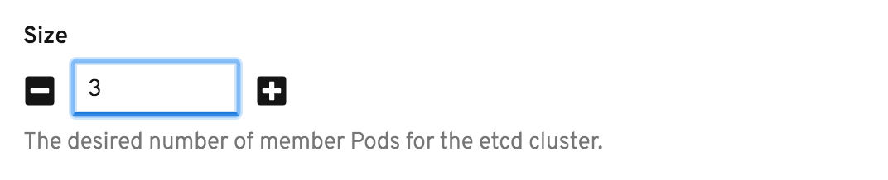</td>
    <td width="50%" style="vertical-align:top">DISPLAY VIEW
      </td>
  </tr>
  <tr>
    <td width="50%" style="vertical-align:top">MODIFY VIEW
      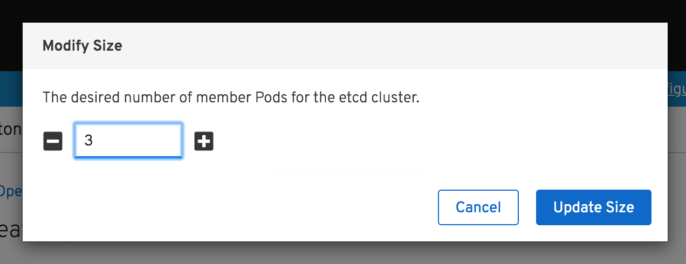</td>
  </tr>
</table>


## resourceRequirements

**x-descriptors**

This descriptor allows you to specify the mini/max amount of compute resources required/allowed. See example from [[CSV] etcd Operator:](https://github.com/operator-framework/community-operators/blob/master/upstream-community-operators/etcd/etcdoperator.v0.9.4.clusterserviceversion.yaml#L248-L252)

```yaml
…
- displayName: Size
  description: Limits describes the minimum/maximum amount of compute resources required/allowed
  path: pod.resources
  x-descriptors:
    - urn:alm:descriptor:com.tectonic.ui:resourceRequirements
…
```

**UI**
<table style="width:100%">
  <tr>
    <td width="50%" style="vertical-align:top">CREATION VIEW
      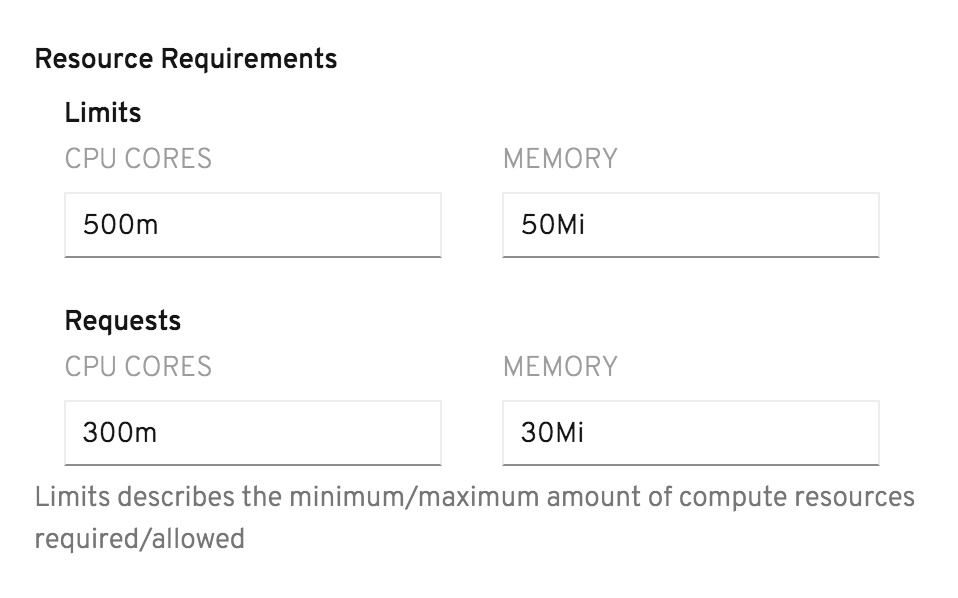</td>
    <td width="50%">DISPLAY VIEW
      </td>
  </tr>
  <tr>
    <td width="50%" style="vertical-align:top">MODIFY VIEW - Resource Limits
      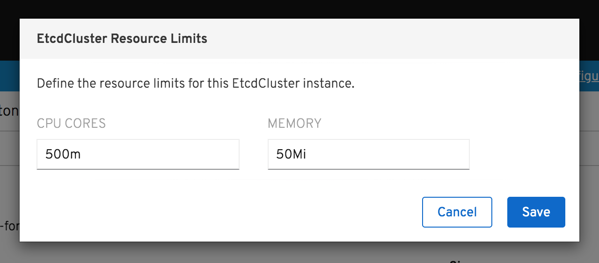</td>
    <td width="50%" style="vertical-align:top">MODIFY VIEW - Resource Requests
      </td>
  </tr>
</table>


## Kubernetes Object

**x-descriptors**

This descriptor allows you to specify the prerequisite kubernetes object (e.g. _Secrets, ServiceAccount, Service, ConfigMap, Namespace, etc_) for your instance. See example from Couchbase Operator:

```yaml
…
- displayName: Server TLS Secret
  description: The name of the secret object that stores the server's TLS certificate.
  path: tls.static.member.serverSecret
  x-descriptors:
    - urn:alm:descriptor:io.kubernetes:Secret
…
```

**UI**
<table style="width:100%">
  <tr>
    <td width="50%" style="vertical-align:top">CREATION VIEW
      </td>
    <td width="50%" style="vertical-align:top">DISPLAY VIEW
      </td>
  </tr>
  <tr>
    <td colspan="2" style="vertical-align:top">MODIFY VIEW
      <p><small><b>* </b><i> Currently, this descriptor does not provide “Modify View”. Users would have to edit the content of the actual kubernetes object being specified.</i></small></p>
      </td>
  </tr>
</table>


## booleanSwitch

**x-descriptors**

This descriptor allows you to specify the _true_ or _false_ value for the configuration. See example from Couchbase Operator:

```yaml
…
- displayName: Paused
  description: Specifies if the Operator will manage this cluster.
  path: paused
  value: false
  x-descriptors:
    - urn:alm:descriptor:com.tectonic.ui:booleanSwitch
…
```

**UI**
<table style="width:100%">
  <tr>
    <td width="50%" style="vertical-align:top">CREATION VIEW
      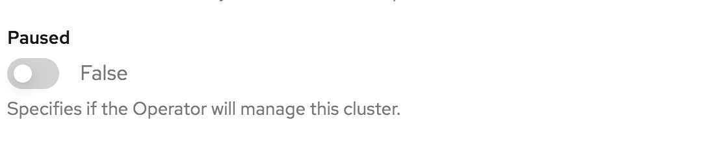</td>
    <td width="50%" style="vertical-align:top">DISPLAY VIEW
      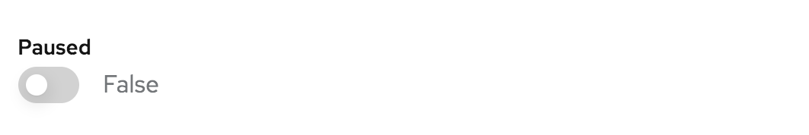</td>
  </tr>
  <tr style="vertical-align:top">
    <td width="50%">MODIFY VIEW
      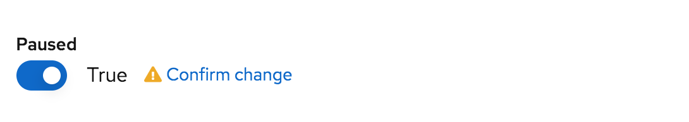</td>
  </tr>
</table>


## Checkbox

**x-descriptors**

This descriptor allows you to specify the _true_ or _false_ value for the configuration. See example:

```yaml
…
- displayName: Optional Item
  description: Specifies if the optional item will be selected or not.
  path: examplePath
  value: false
  x-descriptors:
    - urn:alm:descriptor:com.tectonic.ui:checkbox
…
```

**UI**
<table style="width:100%">
  <tr style="vertical-align:top">
    <td width="50%">CREATION VIEW
      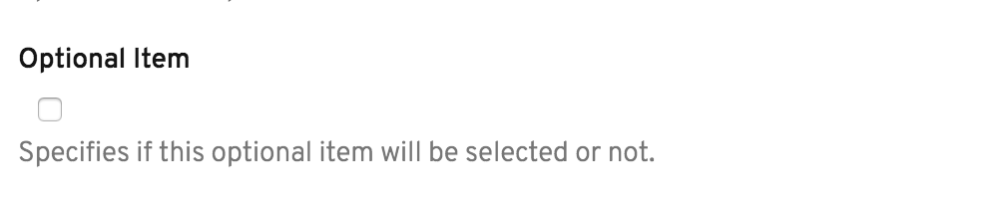</td>
    <td width="50%">DISPLAY VIEW
      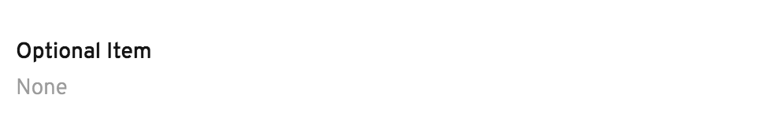
      <p><small><b>[TODO]</b><i> Display View should show checkbox, similar to booleanSwitch.</small></i></p></td>

  </tr>
  <tr style="vertical-align:top">
    <td colspan="2">MODIFY VIEW
      <p><small><b>[TODO]</b><i> * Currently Missing.</i></small></p>
      </td>
  </tr>
</table>


## Text Input

**x-descriptors**

This descriptor allows you to specify a text input for a _string_ data type. See example for Portworx Operator:

```yaml
…
- displayName: Image
  description: The docker image name and version of Portworx Enterprise.
  path: image
  x-descriptors:
    - urn:alm:descriptor:com.tectonic.ui:text
…
```

**UI**
<table style="width:100%">
  <tr style="vertical-align:top">
    <td width="50%">CREATION VIEW
      </td>
    <td width="50%">DISPLAY VIEW
      </td>
  </tr>
  <tr style="vertical-align:top">
    <td colspan="2">MODIFY VIEW
      <p><small><b>* </b><i> Currently, this descriptor does not provide “Modify View”. Users would have to edit the content with YAML editor.</i></small></p>
      </td>
  </tr>
</table>


## Number Input

**x-descriptors**

This descriptor allows you to specify a number input for a _number_ data type. See example for Portworx Operator:

```yaml
…
- displayName: Start Port
  description: The Start Port of Portworx
  path: startPort
  x-descriptors:
    - urn:alm:descriptor:com.tectonic.ui:number
…
```

**UI**
<table style="width:100%">
  <tr style="vertical-align:top">
    <td width="50%">CREATION VIEW
      </td>
    <td width="50%">DISPLAY VIEW
      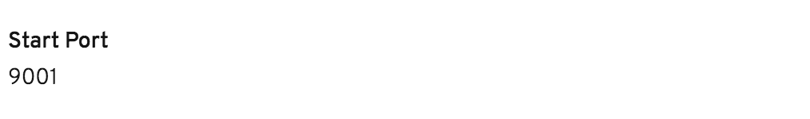</td>
  </tr>
  <tr style="vertical-align:top">
    <td colspan="2">MODIFY VIEW
      <p><small><b>* </b><i> Currently, this descriptor does not provide “Modify View”. Users would have to edit the content with YAML editor.</i></small></p>
      </td>
  </tr>
</table>


## Password Input

**x-descriptors**

This descriptor allows you to specify a number input for a _password_ data type. See example for Grafana Operator:

```yaml
…
- displayName: Admin Password
  description: The Admin Password of Grafana.
  path: adminPassword
  x-descriptors:
    - urn:alm:descriptor:com.tectonic.ui:password
…
```

**UI**
<table style="width:100%">
  <tr style="vertical-align:top">
    <td width="50%">CREATION VIEW
      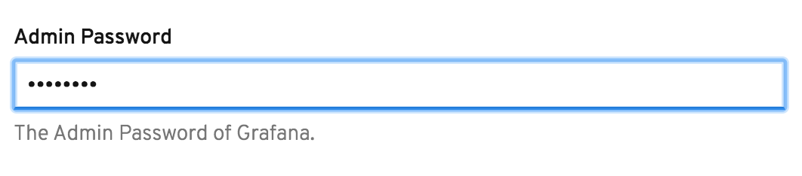</td>
    <td width="50%">DISPLAY VIEW
      
      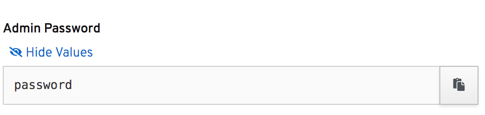</td>
  </tr>
  <tr style="vertical-align:top">
    <td colspan="2">MODIFY VIEW
      <p><small><b>* </b><i> Currently, this descriptor does not provide “Modify View”. Users would have to edit the content with YAML editor.</i></small></p>
      </td>
  </tr>
</table>


## Update Strategy

**x-descriptors**

This descriptor allows you to specify the strategy of your pods being replaced when a new version of the deployment exist. See example for Portworx Operator:

```yaml
…
- displayName: Update Strategy
  description: The update strategy of the deployment
  path: updateStrategy
  x-descriptors:
    - urn:alm:descriptor:com.tectonic.ui:updateStrategy
…
```

**UI**
<table style="width:100%">
  <tr style="vertical-align:top">
    <td width="50%">CREATION VIEW
      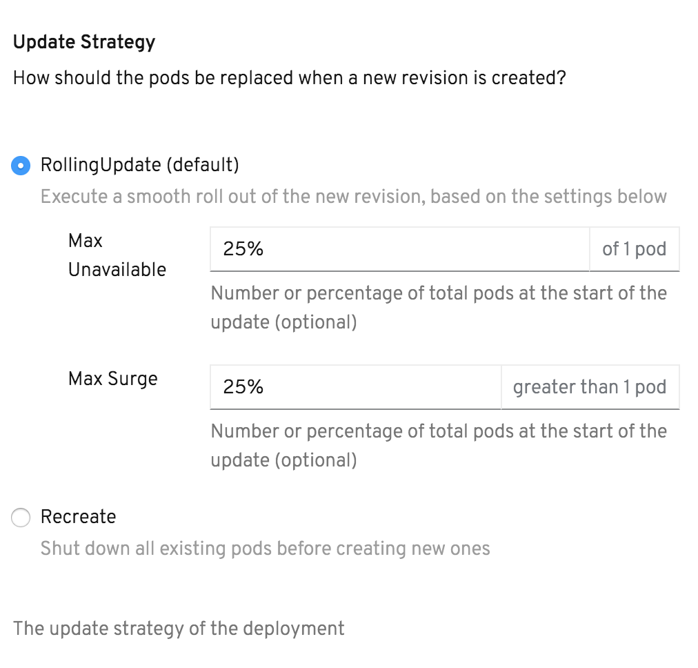</td>
    <td width="50%">DISPLAY VIEW
      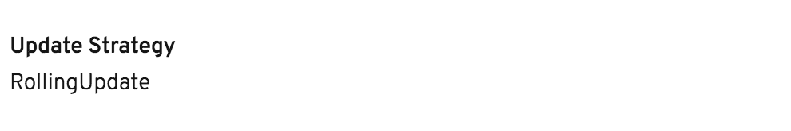
      <p><small><b>[TODO]</b><i> Missing the display of "Max Unavailable" and "Max Surge"</small></i></p>
  </tr>
  <tr style="vertical-align:top">
    <td colspan="2">MODIFY VIEW
      <p><small><b>[TODO]</b><i> * Currently Missing - The DISPLAY VIEW should be a text link to be able to access MODIFY VIEW that renders widget on the modal.
</i></small></p>
      </td>
  </tr>
</table>


## Image Pull Policy

**x-descriptors**

This descriptor allows you to specify the policy for pulling your container image. See example from Appsody Operator:

```yaml
…
- displayName: Pull Policy
  description: image pull policy for container image
  path: pullPolicy
  x-descriptors:
    - urn:alm:descriptor:com.tectonic.ui:imagePullPolicy
…
```

**UI**
<table style="width:100%">
  <tr style="vertical-align:top">
    <td width="50%">CREATION VIEW
      </td>
    <td width="50%">DISPLAY VIEW
      </td>
  </tr>
  <tr style="vertical-align:top">
    <td colspan="2">MODIFY VIEW
      <p><small><b>[TODO]</b><i> * Currently Missing - The DISPLAY VIEW should be a text link to be able to access MODIFY VIEW that renders widget on the modal.
</i></small></p>
      </td>
  </tr>
</table>


## Node Affinity

**x-descriptors**

This descriptor allows you to specify which nodes your pod is eligible to be scheduled on based on _labels on the node_. See example for Prometheus Operator:

```yaml
…
- displayName: Node Affinity
  description: Node affinity is a group of node affinity scheduling
  path: affinity.nodeAffinity
  x-descriptors:    
    - urn:alm:descriptor:com.tectonic.ui:nodeAffinity
…
```

**UI**
<table style="width:100%">
  <tr style="vertical-align:top">
    <td width="50%">CREATION VIEW
      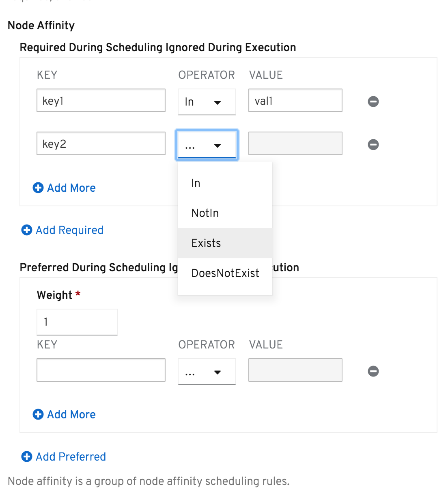
      <p><small><b>[TODO]</b><i> the dropdown for "OPERATOR" field is not wide enough to display "NotIn", "Exists", "DoesNotExist" (only as "...") when collapsed.</small></i></p></td>
    <td width="50%">DISPLAY VIEW
      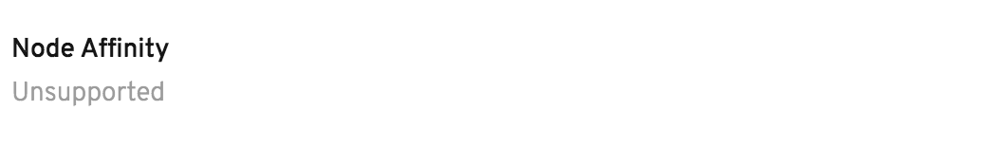
      <p><small><b>[TODO]</b><i> cannot display the configuration</small></i></p></td>
  </tr>
  <tr style="vertical-align:top">
    <td colspan="2">MODIFY VIEW
      <p><small><b>[TODO]</b><i> * Currently Missing - The DISPLAY VIEW should be a text link to be able to access MODIFY VIEW that renders widget on the modal.
</i></small></p>
      </td>
  </tr>
</table>


## Pod Affinity

**x-descriptors**

This descriptor allows you to specify which nodes your pod is eligible to be scheduled based on _labels on pods_ that are already running on the node. See example for Prometheus Operator:

```yaml
…
- displayName: Pod Affinity
  description: Pod affinity is a group of inter pod affinity scheduling rules.
  path: affinity.podAntiAffinity
  x-descriptors:     
    - urn:alm:descriptor:com.tectonic.ui:podAffinity
…
```

**UI**
<table style="width:100%">
  <tr style="vertical-align:top">
    <td width="50%">CREATION VIEW
      
      <p><small><b>[TODO]</b><i> the dropdown for "OPERATOR" field is not wide enough to display "NotIn", "Exists", "DoesNotExist" (only as "...") when collapsed.</small></i></p></td>
    <td width="50%">DISPLAY VIEW
      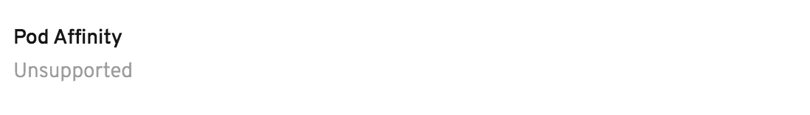
      <p><small><b>[TODO]</b><i> cannot display the configuration</small></i></p></td>
  </tr>
  <tr style="vertical-align:top">
    <td colspan="2">MODIFY VIEW
      <p><small><b>[TODO]</b><i> * Currently Missing - The DISPLAY VIEW should be a text link to be able to access MODIFY VIEW that renders widget on the modal.
</i></small></p>
      </td>
  </tr>
</table>


## Pod Anti-affinity

**x-descriptors**

This descriptor allows you to specify which nodes your pod is eligible to be scheduled based on _labels on pods_ that are already running on the node. See example for Prometheus Operator:

```yaml
…
- displayName: Pod Anti Affinity
  description: Pod anti affinity is a group of inter pod anti affinity scheduling rules.
  path: affinity.podAntiAffinity
  x-descriptors:
    - urn:alm:descriptor:com.tectonic.ui:podAntiAffinity
…
```

**UI**
<table style="width:100%">
  <tr style="vertical-align:top">
    <td width="50%">CREATION VIEW
      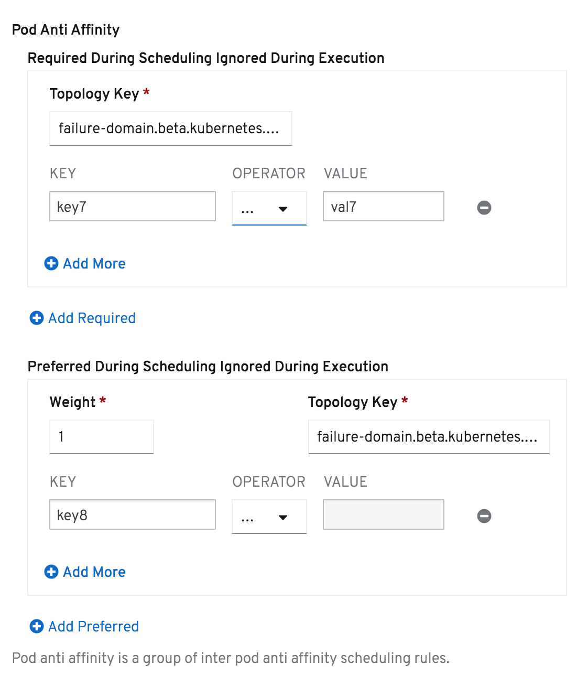
      <p><small><b>[TODO]</b><i> the dropdown for "OPERATOR" field is not wide enough to display "NotIn", "Exists", "DoesNotExist" (only as "...") when collapsed.</small></i></p></td>
    <td width="50%">DISPLAY VIEW
      
      <p><small><b>[TODO]</b><i> cannot display the configuration</small></i></p></td>
  </tr>
  <tr style="vertical-align:top">
    <td colspan="2">MODIFY VIEW
      <p><small><b>[TODO]</b><i> * Currently Missing - The DISPLAY VIEW should be a text link to be able to access MODIFY VIEW that renders widget on the modal.
</i></small></p>
      </td>
  </tr>
</table>


## Selector

**x-descriptors**

This descriptor allows you to specify labels for identifying a set of objects via a _label selector_ (The label selector is the core grouping primitive in Kubernetes). See example from [[CSV] Prometheus Operator](https://github.com/operator-framework/community-operators/blob/master/upstream-community-operators/prometheus/prometheusoperator.0.27.0.clusterserviceversion.yaml#L231-L235):

```yaml
…
- displayName: Rule Config Map Selector
  description: A selector for the ConfigMaps from which to load rule files
  path: ruleSelector
  x-descriptors:
    - urn:alm:descriptor:com.tectonic.ui:selector:core:v1:ConfigMap
…
```

**UI**
<table style="width:100%">
  <tr style="vertical-align:top">
    <td width="50%">CREATION VIEW
        <p><small><b>[TODO]</b><i> * Currently Missing - The CREATION VIEW should allow users to define “a set of labels” for “matchLabels”, similar to Console’s “Search” view.
        </i></small></p></td>
    <td width="50%">DISPLAY VIEW
      </td>
  </tr>
  <tr style="vertical-align:top">
    <td colspan="2">MODIFY VIEW
      <p><small><b>[TODO]</b><i> Currently Missing</i></small></p>
      </td>
  </tr>
</table>

See Kubernetes doc for details in
[resources-that-support-set-based-requirement](https://kubernetes.io/docs/concepts/overview/working-with-objects/labels/#resources-that-support-set-based-requirements).


## Field Group

**x-descriptors**

This descriptor allows you to specify a set of fields together as a _group_. Nested fields will automatically be grouped using the CRD&#39;s OpenAPI validation. See example for Portworx Operator:

```yaml
…
- displayName: Enabled
  description: Specifies if Stork is enabled.
  path: stork.enabled
  x-descriptors:
    - urn:alm:descriptor:com.tectonic.ui:fieldGroup:Stork
    - urn:alm:descriptor:com.tectonic.ui:booleanSwitch
- displayName: Image
  description: The docker image name and version of Stork.
  path: stork.image
  x-descriptors:
    - urn:alm:descriptor:com.tectonic.ui:fieldGroup:stork
    - urn:alm:descriptor:com.tectonic.ui:text
…
```

**UI**
<table style="width:100%">
  <tr style="vertical-align:top">
    <td width="50%">CREATION VIEW
      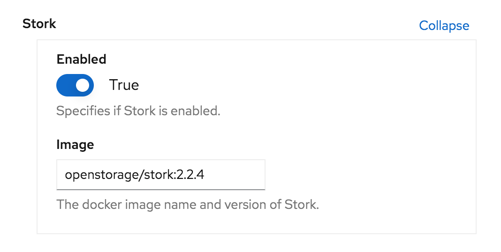
    <td width="50%">DISPLAY VIEW
      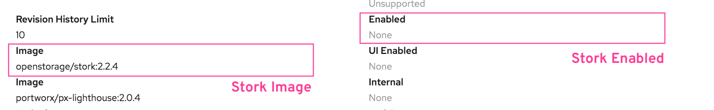
      <p><small><b>[TODO]</b><i> Cannot display fields in a group</small></i></p></td>
  </tr>
  <tr style="vertical-align:top">
    <td colspan="2">MODIFY VIEW
      <p><small><b>[TODO]</b><i> * boolean toggles are not displayed as toggle so cannot edit the config</i></small></p>
      </td>
  </tr>
</table>


## Array Field Group

**x-descriptors**

This descriptor allows you to specify a set of fields together as an _array item_. Nested fields of an array item will automatically be grouped using the CRD&#39;s OpenAPI validation. See example for Strimzi Operator:

```yaml
…
- description: The Broker ID to be assigned with the specified Storage Class.
  displayName: Broker ID
  path: kafka.storage.overrides[0].broker
  x-descriptors:
    - 'urn:alm:descriptor:com.tectonic.ui:arrayFieldGroup:overrides'
    - 'urn:alm:descriptor:com.tectonic.ui:number'
- description: The Storage Class to be assigned.
  displayName: Storage Class
  path: kafka.storage.overrides[0].class
  x-descriptors:
    - 'urn:alm:descriptor:com.tectonic.ui:arrayFieldGroup:overrides'
    - 'urn:alm:descriptor:io.kubernetes:StorageClass'
…
```

**UI**
<table style="width:100%">
  <tr style="vertical-align:top">
    <td width="50%">CREATION VIEW
      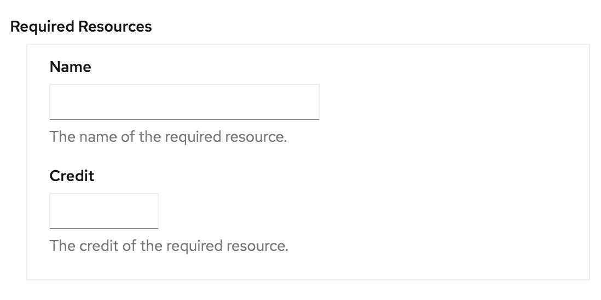
      <p><small><b>[TODO]</b><i> Currently the widget doesn't support add/remove item</i></p></td>
    <td width="50%">DISPLAY VIEW
      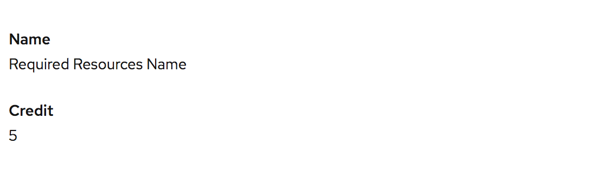
      <p><small><b>[TODO]</b><i> Cannot display fields in a group</small></i></p></td>
  </tr>
  <tr style="vertical-align:top">
    <td colspan="2">MODIFY VIEW
      <p><small><b>* </b><i> Currently Missing.</i></small></p>
      </td>
  </tr>
</table>


## Select

**x-descriptors**

This descriptor allows you to specify a set of predefined options (e.g. `enum:` type) for a dropdownUI component. See example for Strimzi Apache Kafka Operator:

```yaml
…
 - displayName: Kafka storage
   description: The type of storage used by Kafka brokers
   path: kafka.storage.type
   x-descriptors:
     - 'urn:alm:descriptor:com.tectonic.ui:select:ephemeral'
     - 'urn:alm:descriptor:com.tectonic.ui:select:persistent-claim'
     - 'urn:alm:descriptor:com.tectonic.ui:select:jbod'
…
```

**UI**
<table style="width:100%">
  <tr style="vertical-align:top">
    <td width="50%">CREATION VIEW
      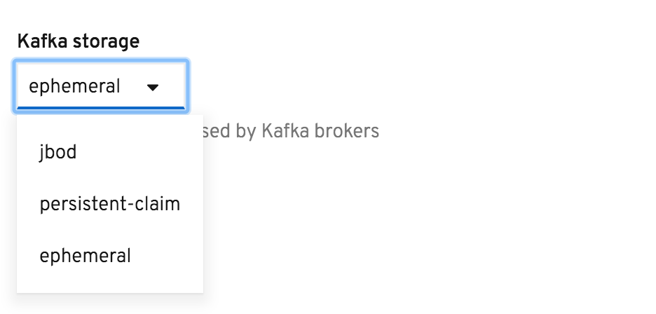</td>
    <td width="50%">DISPLAY VIEW
      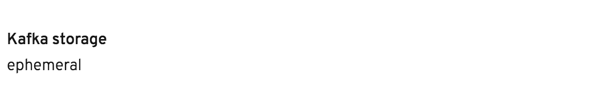</td>
  </tr>
  <tr style="vertical-align:top">
    <td colspan="2">MODIFY VIEW
      <p><small><b>* </b><i> Currently, this descriptor does not provide “Modify View”. Users would have to edit the content of the actual kubernetes object being specified.</i></small></p>
      </td>
  </tr>
</table>


## Advanced

**x-descriptors**

This descriptor allows you to specify fields as &quot;Advanced&quot; options and will be displayed at the latter section of the form. See example for Business Automation Operator:

```yaml
…
- description: Selected if the image registry is insecure.
  displayName: Insecure
  path: imageRegistry.insecure
  x-descriptors:
    - 'urn:alm:descriptor:com.tectonic.ui:booleanSwitch'
    - 'urn:alm:descriptor:com.tectonic.ui:advanced'
- description: >- Image registry's base 'url:port'. e.g. registry.example.com:5000.
        Defaults to 'registry.redhat.io'.
  displayName: Registry
  path: imageRegistry.registry
  x-descriptors:
    - 'urn:alm:descriptor:com.tectonic.ui:text'
    - 'urn:alm:descriptor:com.tectonic.ui:advanced'
…
```

**UI**
<table style="width:100%">
  <tr style="vertical-align:top">
    <td width="50%">CREATION VIEW
      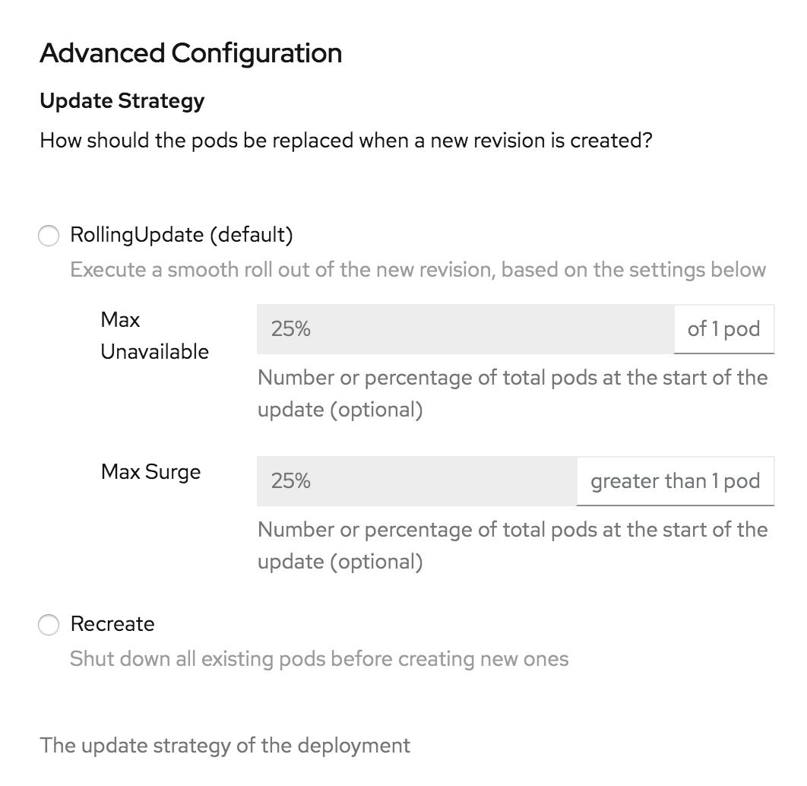</td>
    <td width="50%">DISPLAY VIEW
      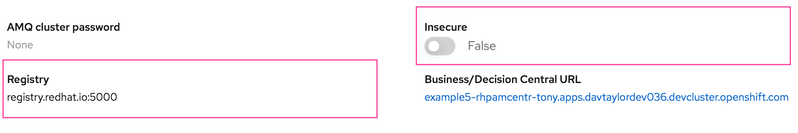
      <p><small><b>[TODO]</b><i> * Currently Missing.</i></small></p></td>
  </tr>
  <tr style="vertical-align:top">
    <td colspan="2">MODIFY VIEW
      <p><small><b>* </b><i> Currently, this descriptor does not provide “Modify View”.</i></small></p></td>
  </tr>
</table>


## Endpoint List

**x-descriptors**

This descriptor is created specifically for Prometheus Operator to specify a list of endpoints allowed for the ServiceMonitor it manages. See example from [[CSV] Prometheus Operator](https://github.com/operator-framework/community-operators/blob/master/upstream-community-operators/prometheus/prometheusoperator.0.27.0.clusterserviceversion.yaml#L270-L274):

```yaml
…
- displayName: Endpoints
  description: A list of endpoints allowed as part of this ServiceMonitor
  path: endpoints
  x-descriptors:
    - urn:alm:descriptor:com.tectonic.ui:endpointList
…
```

**UI**
<table style="width:100%">
  <tr style="vertical-align:top">
    <td width="50%">CREATION VIEW
      <p><small><b>* </b><i> Currently, this descriptor does not provide “Creation View”.</small></i></p></td>
    <td width="50%">DISPLAY VIEW
      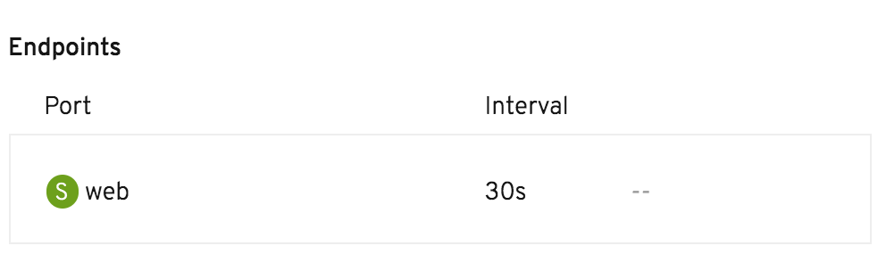</td>
  </tr>
  <tr style="vertical-align:top">
    <td colspan="2">MODIFY VIEW
      <p><small><b>* </b><i> Currently, this descriptor does not provide “Modify View”. Users would have to edit the content with YAML editor.</i></small></p>
      </td>
  </tr>
</table>


## DEPRECATED Descriptors

### Label **[DEPRECATED]**

**x-descriptors**
```yaml
…
x-descriptors:
    - urn:alm:descriptor:com.tectonic.ui:label
…
```
* Use [Text Input](#text-input) instead for `string` data type input/output.


### namespaceSelector **[DEPRECATED]**

**x-descriptors**
```yaml
…
x-descriptors:
    urn:alm:descriptor:com.tectonic.ui:namespaceSelector
…
```
* Use [Kubernetes Object](#kubernetes-object) instead.
