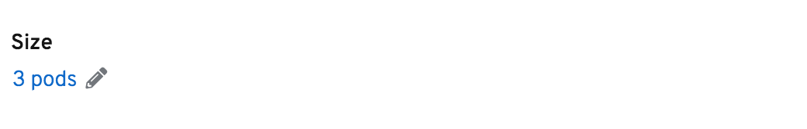
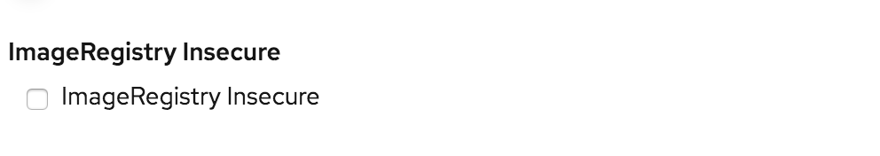
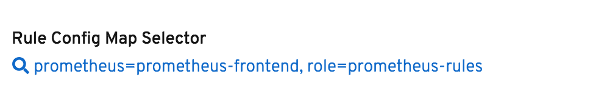
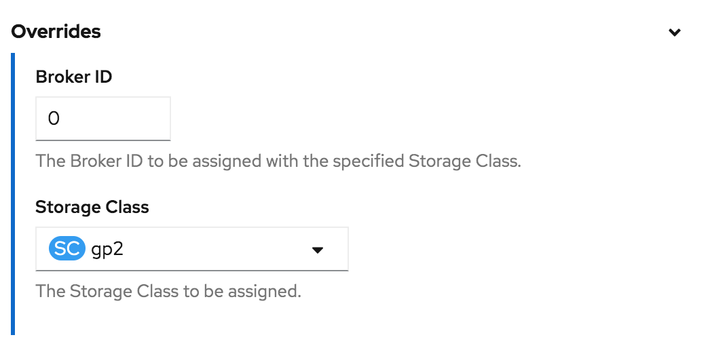

# OLM Descriptor Reference

#### [specDescriptors](#specDescriptors-1):
  1. [podCount](#1-podcount)
  2. [resourceRequirements](#2-resourcerequirements)
  3. [k8sResourcePrefix](#3-k8sResourcePrefix)
  4. [booleanSwitch](#4-booleanswitch)
  5. [checkbox](#5-checkbox)
  6. [text](#6-text)
  7. [number](#7-number)
  8. [password](#8-password)
  9. [updateStrategy](#9-updatestrategy)
  10. [imagePullPolicy](#10-imagepullpolicy)
  11. [nodeAffinity](#11-nodeaffinity)
  12. [podAffinity](#12-podaffinity)
  13. [podAntiAffinity](#13-podantiaffinity)
  14. [selector](#14-selector)
  15. [_DEPRECATED_ fieldGroup](#fieldGroup) 
  16. [_DEPRECATED_ arrayFieldGroup](#arrayFieldGroup)
  17. [select](#17-select)
  18. [advanced](#18-advanced)
  19. [endpointList](#19-endpointList)
  20. [fieldDependency](#20-fielddependency)
  21. [hidden](#21-hidden)
---------------------------------------

#### [statusDescriptors](#statusDescriptors-1):
  1. [podStatuses](#1-podStatuses)
  2. [w3Link](#2-w3Link)
  3. [conditions](#3-conditions)
  4. [text](#4-text)
  5. [k8sPhase](#5-k8sPhase)
  6. [k8sPhaseReason](#6-k8sPhaseReason)
  7. [k8sResourcePrefix](#7-k8sResourcePrefix)
---------------------------------------

#### [DEPRECATED Descriptors](#deprecated-descriptors-1)
  15. [fieldGroup](#fieldGroup)
  16. [arrayFieldGroup](#arrayFieldGroup)


## specDescriptors
A specDescriptor is for describing the property of a `spec` field in your Custom Resource. Each entry should contain the following:
* `displayName` - _The user-friendly name of the field_
* `description` - _Concise information about what the field represents_
* `path` - _The dot-delimited path of the field in the object_
* `x-descriptors` (Optional) - _UI component information about the field capabilities_

You can customize how a field is presented in the UI with a specDescriptor. Use a user-friendly `displayName` and concise `description` to overwrite the field name and potentially lengthy description of a field in the schema based on where the `path` is pointing to. This applies to any schema property and in any level of the nested structures.

The `x-descriptors` is used to determine which "capabilities" this descriptor has and which UI component to use on different views in the OpenShift Console.

For example, some `x-descriptors` also provides a "DISPLAY VIEW" that allows you to expose the specified schema property on Operand's Details view in the console as well as on the Creation Form. A canonical list of React UI `x-descriptors` for OpenShift can be found below.

You can see more information on [Operand's Creation Forms](../../descriptors#create-operand-form).


### x-descriptors

#### 1. podCount

**x-descriptors**

This descriptor allows you to specify the number of pods for your instance. See example from [[CSV] etcd Operator](https://github.com/operator-framework/community-operators/blob/master/community-operators/etcd/0.9.4/etcdoperator.v0.9.4.clusterserviceversion.yaml#L40-L44):

```yaml
…
- displayName: Size
  description: The desired number of member Pods for the etcd cluster.
  path: size
  x-descriptors:
  - 'urn:alm:descriptor:com.tectonic.ui:podCount'
…
```

**UI**
<table style="width:100%">
  <tr valign="top">
    <td width="50%">CREATION VIEW
      </td>
    <td width="50%">DISPLAY VIEW
      </td>
  </tr>
  <tr valign="top">
    <td width="50%">MODIFY VIEW
      </td>
  </tr>
</table>


#### 2. resourceRequirements

**x-descriptors**

This descriptor allows you to specify the mini/max amount of compute resources required/allowed. See example from [[CSV] etcd Operator](https://github.com/operator-framework/community-operators/blob/master/community-operators/etcd/0.9.4/etcdoperator.v0.9.4.clusterserviceversion.yaml#L45-L50):

```yaml
…
- displayName: Size
  description: Limits describes the minimum/maximum amount of compute resources required/allowed
  path: pod.resources
  x-descriptors:
    - 'urn:alm:descriptor:com.tectonic.ui:resourceRequirements'
…
```

**UI**
<table style="width:100%">
  <tr valign="top">
    <td width="50%">CREATION VIEW
      </td>
    <td width="50%">DISPLAY VIEW
      </td>
  </tr>
  <tr valign="top">
    <td width="50%">MODIFY VIEW - Resource Limits
      </td>
    <td width="50%">MODIFY VIEW - Resource Requests
      </td>
  </tr>
</table>


#### 3. k8sResourcePrefix

**x-descriptors**

This descriptor allows you to specify the prerequisite kubernetes object (e.g. _Secrets, ServiceAccount, Service, ConfigMap, Namespace, etc_) for your instance. See example from
[[CSV] Couchbase Operator](https://github.com/operator-framework/community-operators/blob/master/upstream-community-operators/couchbase-enterprise/1.2.2/couchbase-v1.2.2.clusterserviceversion.yaml#L96-L101):

```yaml
…
- displayName: Server TLS Secret
  description: The name of the secret object that stores the server's TLS certificate.
  path: tls.static.member.serverSecret
  x-descriptors:
    - 'urn:alm:descriptor:io.kubernetes:Secret'
…
```

**UI**
<table style="width:100%">
  <tr valign="top">
    <td width="50%">CREATION VIEW
      </td>
    <td width="50%">DISPLAY VIEW
      </td>
  </tr>
  <tr valign="top">
    <td colspan="2" >MODIFY VIEW
      <h6><small><b>* </b><i> Currently, this descriptor does not provide “Modify View”. Users would have to edit the content of the actual kubernetes object being specified.</i></small></h6>
      </td>
  </tr>
</table>


#### 4. booleanSwitch

**x-descriptors**

This descriptor allows you to specify the _true_ or _false_ value for the configuration. See example from [[CSV] Eclipse Che Operator](https://github.com/operator-framework/community-operators/blob/master/community-operators/eclipse-che/7.8.0/eclipse-che.v7.8.0.clusterserviceversion.yaml#L70-L74):

```yaml
…
- description: TLS routes
  displayName: TLS Mode
  path: server.tlsSupport
  x-descriptors:
    - urn:alm:descriptor:com.tectonic.ui:booleanSwitch
…
```

**UI**
<table style="width:100%">
  <tr valign="top">
    <td width="50%">CREATION VIEW
      </td>
    <td width="50%">DISPLAY VIEW
      </td>
  </tr>
  <tr valign="top">
    <td width="50%">MODIFY VIEW
      </td>
  </tr>
</table>


#### 5. checkbox

**x-descriptors**

This descriptor allows you to specify the _true_ or _false_ value for the configuration. See example for Business Automation Operator:

```yaml
…
- displayName: ImageRegistry Insecure
  description: A flag used to indicate the specified registry is insecure.
  path: imageRegistry.insecure
  x-descriptors:
    - 'urn:alm:descriptor:com.tectonic.ui:checkbox'
…
```

**UI**
<table style="width:100%">
  <tr valign="top">
    <td width="50%">CREATION VIEW
      </td>
    <td width="50%">DISPLAY VIEW
      </td>
  </tr>
  <tr valign="top">
    <td colspan="2">MODIFY VIEW
      <h6><small><i><b>* </b>Display View also serves as the Modify view.</i></small></h6>
      </td>
  </tr>
</table>


#### 6. text

**x-descriptors**

This descriptor allows you to specify a text input for a _string_ data type. See example from [[CSV] Portworx Operator](https://github.com/operator-framework/community-operators/blob/master/upstream-community-operators/portworx/1.1.0/portworxoperator.v1.1.0.clusterserviceversion.yaml#L243-L247):

```yaml
…
- displayName: Image
  description: The docker image name and version of Portworx Enterprise.
  path: image
  x-descriptors:
    - 'urn:alm:descriptor:com.tectonic.ui:text'
…
```

**UI**
<table style="width:100%">
  <tr valign="top">
    <td width="50%">CREATION VIEW
      </td>
    <td width="50%">DISPLAY VIEW
      </td>
  </tr>
  <tr valign="top">
    <td colspan="2">MODIFY VIEW
      <h6><small><b>* </b><i> Currently, this descriptor does not provide “Modify View”. Users would have to edit the content with YAML editor.</i></small></h6>
      </td>
  </tr>
</table>


#### 7. number

**x-descriptors**

This descriptor allows you to specify a number input for a _number_ data type. See example from [[CSV] KEDA Operator](https://github.com/operator-framework/community-operators/blob/master/community-operators/keda/1.2.0/keda.v1.2.0.clusterserviceversion.yaml#L168-L172):

```yaml
…
- displayName: Cooldown Period
  description: Cooldown Period
  path: cooldownPeriod
  x-descriptors:
    - 'urn:alm:descriptor:com.tectonic.ui:number'
…
```

**UI**
<table style="width:100%">
  <tr valign="top">
    <td width="50%">CREATION VIEW
      </td>
    <td width="50%">DISPLAY VIEW
      </td>
  </tr>
  <tr valign="top">
    <td colspan="2">MODIFY VIEW
      <h6><small><b>* </b><i> Currently, this descriptor does not provide “Modify View”. Users would have to edit the content with YAML editor.</i></small></h6>
      </td>
  </tr>
</table>


#### 8. password

**x-descriptors**

This descriptor allows you to specify a text input for a _password_ data type. See example for Grafana Operator:

```yaml
…
- displayName: Admin Password
  description: The Admin Password of Grafana.
  path: adminPassword
  x-descriptors:
    - 'urn:alm:descriptor:com.tectonic.ui:password'
…
```

**UI**
<table style="width:100%">
  <tr valign="top">
    <td width="50%">CREATION VIEW
      </td>
    <td width="50%">DISPLAY VIEW
      
      </td>
  </tr>
  <tr valign="top">
    <td colspan="2">MODIFY VIEW
      <h6><small><b>* </b><i> Currently, this descriptor does not provide “Modify View”. Users would have to edit the content with YAML editor.</i></small></h6>
      </td>
  </tr>
</table>


#### 9. updateStrategy

**x-descriptors**

This descriptor allows you to specify the strategy of your pods being replaced when a new version of the deployment exist. See example for Portworx Operator:

```yaml
…
- displayName: Update Strategy
  description: The update strategy of the deployment
  path: updateStrategy
  x-descriptors:
    - 'urn:alm:descriptor:com.tectonic.ui:updateStrategy'
…
```

**UI**
<table style="width:100%">
  <tr valign="top">
    <td width="50%">CREATION VIEW
      </td>
    <td width="50%">DISPLAY VIEW
      
      <h6><small><b>[TODO]</b><i> Missing the display of "Max Unavailable" and "Max Surge"</small></i></p>
  </tr>
  <tr valign="top">
    <td width="50%">MODIFY VIEW
      </td>
  </tr>
</table>


#### 10. imagePullPolicy

**x-descriptors**

This descriptor allows you to specify the policy for pulling your container image. See example from [[CSV] Appsody Operator](https://github.com/operator-framework/community-operators/blob/master/upstream-community-operators/appsody-operator/0.3.0/appsody-operator.v0.3.0.clusterserviceversion.yaml#L49-L53):

```yaml
…
- displayName: Pull Policy
  description: image pull policy for container image
  path: pullPolicy
  x-descriptors:
    - 'urn:alm:descriptor:com.tectonic.ui:imagePullPolicy'
…
```

**UI**
<table style="width:100%">
  <tr valign="top">
    <td width="50%">CREATION VIEW
      </td>
    <td width="50%">DISPLAY VIEW
      </td>
  </tr>
  <tr valign="top">
    <td colspan="2">MODIFY VIEW
      <h6><small><b>[TODO]</b><i> * Currently Missing - The DISPLAY VIEW should be a text link to be able to access MODIFY VIEW that renders widget on the modal.
</i></small></h6>
      </td>
  </tr>
</table>


#### 11. nodeAffinity

**x-descriptors**

This descriptor allows you to specify which nodes your pod is eligible to be scheduled on based on _labels on the node_. See example for Prometheus Operator:

```yaml
…
- displayName: Node Affinity
  description: Node affinity is a group of node affinity scheduling
  path: affinity.nodeAffinity
  x-descriptors:    
    - 'urn:alm:descriptor:com.tectonic.ui:nodeAffinity'
…
```

**UI**
<table style="width:100%">
  <tr valign="top">
    <td width="50%">CREATION VIEW
      
    <td width="50%">DISPLAY VIEW
      
      <h6><small><b>[TODO]</b><i> cannot display the configuration</small></i></p></td>
  </tr>
  <tr valign="top">
    <td colspan="2">MODIFY VIEW
      <h6><small><b>[TODO]</b><i> * Currently Missing - The DISPLAY VIEW should be a text link to be able to access MODIFY VIEW that renders widget on the modal.
</i></small></h6>
      </td>
  </tr>
</table>


#### 12. podAffinity

**x-descriptors**

This descriptor allows you to specify which nodes your pod is eligible to be scheduled based on _labels on pods_ that are already running on the node. See example for Prometheus Operator:

```yaml
…
- displayName: Pod Affinity
  description: Pod affinity is a group of inter pod affinity scheduling rules.
  path: affinity.podAffinity
  x-descriptors:     
    - 'urn:alm:descriptor:com.tectonic.ui:podAffinity'
…
```

**UI**
<table style="width:100%">
  <tr valign="top">
    <td width="50%">CREATION VIEW
      
    <td width="50%">DISPLAY VIEW
      
      <h6><small><b>[TODO]</b><i> cannot display the configuration</small></i></p></td>
  </tr>
  <tr valign="top">
    <td colspan="2">MODIFY VIEW
      <h6><small><b>[TODO]</b><i> * Currently Missing - The DISPLAY VIEW should be a text link to be able to access MODIFY VIEW that renders widget on the modal.
</i></small></h6>
      </td>
  </tr>
</table>


#### 13. podAntiAffinity

**x-descriptors**

This descriptor allows you to specify which nodes your pod is eligible to be scheduled based on _labels on pods_ that are already running on the node. See example for Prometheus Operator:

```yaml
…
- displayName: Pod Anti Affinity
  description: Pod anti affinity is a group of inter pod anti affinity scheduling rules.
  path: affinity.podAntiAffinity
  x-descriptors:
    - 'urn:alm:descriptor:com.tectonic.ui:podAntiAffinity'
…
```

**UI**
<table style="width:100%">
  <tr valign="top">
    <td width="50%">CREATION VIEW
      
    <td width="50%">DISPLAY VIEW
      
      <h6><small><b>[TODO]</b><i> cannot display the configuration</small></i></p></td>
  </tr>
  <tr valign="top">
    <td colspan="2">MODIFY VIEW
      <h6><small><b>[TODO]</b><i> * Currently Missing - The DISPLAY VIEW should be a text link to be able to access MODIFY VIEW that renders widget on the modal.
</i></small></h6>
      </td>
  </tr>
</table>


#### 14. selector

**x-descriptors**

This descriptor allows you to specify labels for identifying a set of objects via a _label selector_ (The label selector is the core grouping primitive in Kubernetes). See example from [[CSV] Prometheus Operator](https://github.com/operator-framework/community-operators/blob/master/upstream-community-operators/prometheus/prometheusoperator.0.27.0.clusterserviceversion.yaml#L231-L235):

```yaml
…
- displayName: Rule Config Map Selector
  description: A selector for the ConfigMaps from which to load rule files
  path: ruleSelector
  x-descriptors:
    - 'urn:alm:descriptor:com.tectonic.ui:selector:core:v1:ConfigMap'
…
```

**UI**
<table style="width:100%">
  <tr valign="top">
    <td width="50%">CREATION VIEW
        <h6><small><b>[TODO]</b><i> * Currently Missing - The CREATION VIEW should allow users to define “a set of labels” for “matchLabels”, similar to Console’s “Search” view.
        </i></small></h6></td>
    <td width="50%">DISPLAY VIEW
      </td>
  </tr>
  <tr valign="top">
    <td colspan="2">MODIFY VIEW
      <h6><small><b>[TODO]</b><i> Currently Missing</i></small></h6>
      </td>
  </tr>
</table>

See Kubernetes doc for details in
[resources-that-support-set-based-requirement](https://kubernetes.io/docs/concepts/overview/working-with-objects/labels/#resources-that-support-set-based-requirements).


#### 15. fieldGroup
This x-descriptor has been __deprecated__. See the [entry in the deprecated](#fieldGroup) section.

#### 16. arrayFieldGroup
This x-descriptor has been __deprecated__. See the [entry in the deprecated](#arrayFieldGroup) section.

#### 17. select

**x-descriptors**

This descriptor allows you to specify a set of predefined options (e.g. `enum:` type) for a dropdownUI component. See example from [[CSV] Strimzi Apache Kafka Operator](https://github.com/operator-framework/community-operators/blob/master/community-operators/strimzi-kafka-operator/0.17.0/strimzi-cluster-operator.v0.17.0.clusterserviceversion.yaml#L335-L341):

```yaml
…
 - displayName: Kafka storage
   description: The type of storage used by Kafka brokers
   path: kafka.storage.type
   x-descriptors:
     - 'urn:alm:descriptor:com.tectonic.ui:select:ephemeral'
     - 'urn:alm:descriptor:com.tectonic.ui:select:persistent-claim'
     - 'urn:alm:descriptor:com.tectonic.ui:select:jbod'
…
```

**UI**
<table style="width:100%">
  <tr valign="top">
    <td width="50%">CREATION VIEW
      </td>
    <td width="50%">DISPLAY VIEW
      </td>
  </tr>
  <tr valign="top">
    <td colspan="2">MODIFY VIEW
      <h6><small><b>* </b><i> Currently, this descriptor does not provide “Modify View”. Users would have to edit the content of the actual kubernetes object being specified.</i></small></h6>
      </td>
  </tr>
</table>


#### 18. advanced

**x-descriptors**

This descriptor allows you to specify fields as &quot;Advanced Configurations&quot; for any schema property. The advanced fields will be displayed within a collapsible section at the bottom of the parent schema structure.  See example for Business Automation Operator:

```yaml
…
- description: Selected if the image registry is insecure.
  displayName: Insecure
  path: imageRegistry.insecure
  x-descriptors:
    - 'urn:alm:descriptor:com.tectonic.ui:booleanSwitch'
    - 'urn:alm:descriptor:com.tectonic.ui:advanced'
- description: >- Image registry's base 'url:port'. e.g. registry.example.com:5000.
        Defaults to 'registry.redhat.io'.
  displayName: Registry
  path: imageRegistry.registry
  x-descriptors:
    - 'urn:alm:descriptor:com.tectonic.ui:text'
    - 'urn:alm:descriptor:com.tectonic.ui:advanced'
…
```

**UI**
<table style="width:100%">
  <tr valign="top">
    <td width="50%">CREATION VIEW
      </td>
    <td width="50%">DISPLAY VIEW
      
      <h6><small><b>[TODO]</b><i> * Currently Missing.</i></small></h6></td>
  </tr>
  <tr valign="top">
    <td colspan="2">MODIFY VIEW
      <h6><small><b>* </b><i> Currently, this descriptor does not provide “Modify View”.</i></small></h6></td>
  </tr>
</table>


#### 19. endpointList

**x-descriptors**

This descriptor is created specifically for Prometheus Operator to specify a list of endpoints allowed for the ServiceMonitor it manages. See example from [[CSV] Prometheus Operator](https://github.com/operator-framework/community-operators/blob/master/upstream-community-operators/prometheus/prometheusoperator.0.27.0.clusterserviceversion.yaml#L270-L274):

```yaml
…
- displayName: Endpoints
  description: A list of endpoints allowed as part of this ServiceMonitor
  path: endpoints
  x-descriptors:
    - 'urn:alm:descriptor:com.tectonic.ui:endpointList'
…
```

**UI**
<table style="width:100%">
  <tr valign="top">
    <td width="50%">CREATION VIEW
      <h6><small><b>* </b><i> Currently, this descriptor does not provide “Creation View”.</small></i></p></td>
    <td width="50%">DISPLAY VIEW
      </td>
  </tr>
  <tr valign="top">
    <td colspan="2">MODIFY VIEW
      <h6><small><b>* </b><i> Currently, this descriptor does not provide “Modify View”. Users would have to edit the content with YAML editor.</i></small></h6>
      </td>
  </tr>
</table>


#### 20. fieldDependency

**x-descriptors**

This descriptor allows you to specify a field as the dependent of a Control Field and shows the Dependent Field when the current value of the Control Field is equal to the expected value:
```yaml
'urn:alm:descriptor:com.tectonic.ui:fieldDependency:CONTROL_FIELD_PATH:EXPECTED_VALUE'
```

**Usage**
1. Add &quot;fieldDependency&quot; to 'x-descriptors' array of the Dependent Field(s).
2. Replace &quot;CONTROL_FIELD_PATH&quot; with the 'path' property of the Control Field object.
3. Replace &quot;EXPECTED_VALUE&quot; with the actual expected value.

**Requirements**
1. &quot;Field dependency&quot; only exists between sibling fields in CRD's schema.
2. The Dependent Field will be exposed right after the Control Field on the form (_ignores the rules mentioned in [Ordering of Form Fields](../../descriptors#ordering-of-form-fields)_).
3. The Dependent Field doesn't have to be a &quot;leaf&quot; in the schema.

The Dependent Field(s) will be displayed only when the current value of the Control Field is equal to the expected value.

**Example**
```yaml
…
- displayName: Enable Upgrades
  description: >-
      Set true to enable automatic micro version product upgrades, it is disabled by default.
  path: upgrades.enabled
  x-descriptors:
      - 'urn:alm:descriptor:com.tectonic.ui:booleanSwitch'
- displayName: Include minor version upgrades
  description: >-
      Set true to enable automatic minor product version upgrades, it is
      disabled by default. Requires spec.upgrades.enabled to be true.
  path: upgrades.minor
  x-descriptors:
      - 'urn:alm:descriptor:com.tectonic.ui:fieldDependency:upgrades.enabled:true'
      - 'urn:alm:descriptor:com.tectonic.ui:booleanSwitch'
…
```

**UI**
<table style="width:100%">
  <tr valign="top">
    <td width="50%">CREATION VIEW
      
      <br>
      <h6><small><b>* </b> When "Enable Upgrades" (CONTROL FIELD) is set to "TRUE":</small></h6>
      
      </td></td>
    <td width="50%">DISPLAY VIEW
      
      <h6><small><b>[TODO]</b><i> cannot display the dependency</small></i></p></td>
  </tr>
  <tr valign="top">
    <td colspan="2">MODIFY VIEW
      <h6><small><b>* </b><i>Currently, this descriptor does not provide “Modify View”.</i></small></h6>
      </td>
  </tr>
</table>


#### 21. hidden

**x-descriptors**

This descriptor allows you to exclude non-user facing fields from the &quot;auto-generated creation form&quot; by specifying them as &quot;hidden&quot; schema fields. See example for Portworx Operator:

```yaml
…
 - displayName: HIDDEN FIELDS - Network and all its children fields
   description: >-
      HIDDEN FIELDS - The network related fields to be used by Portworx for data traffic.
   path: network
   x-descriptors:
     - 'urn:alm:descriptor:com.tectonic.ui:hidden'
 - displayName: HIDDEN FIELDS - Start Port
   description: >-
      HIDDEN FIELDS - It is the starting port in the range of ports used by Portworx.
   path: startPort
   x-descriptors:
     - 'urn:alm:descriptor:com.tectonic.ui:hidden'
…
```

**Usage**
1. You can apply &quot;hidden&quot; to any schema property path (doesn't have to be a &quot;leaf&quot; in the schema). All the children properties, if any, will be hidden as well.
2. The descriptor will hide the target property and all of its child fields.
3. The field(s) will be hidden on the UI but can still be accessed through the YAML editor.

---------------------------------------


## statusDescriptors
A statusDescriptor is for describing the property of a `status` field in your Custom Resource. The structure of the statusDescriptors is similar to specDescriptors and includes the same fields. The only difference is the set of valid `x-descriptors` described below.

### x-descriptors

#### 1. podStatuses

**x-descriptors**

This descriptor allows you to expose the status of pods for your instance. It expects the output format in the status block of your instance in:
```yaml
…
status:
  [PATH_TO_THE_FIELD]:
    [STATE_1]:
      - [FIELD_MEMBER_NAME]
      - [FIELD_MEMBER_NAME]
      - [FIELD_MEMBER_NAME]
    [STATE_2]:
      - [FIELD_MEMBER_NAME]
      - [FIELD_MEMBER_NAME]
    [STATE_3]:
      - [FIELD_MEMBER_NAME]
…
```

**Example**

See example from [[CSV] 3Scale Operator](https://github.com/operator-framework/community-operators/blob/master/community-operators/3scale-community-operator/0.4.0/3scale-community-operator.v0.4.0.clusterserviceversion.yaml#L53-L57):

```yaml
…
- displayName: Deployments
  description: API Manager Deployment Configs
  path: deployments
  x-descriptors:
    - 'urn:alm:descriptor:com.tectonic.ui:podStatuses'
…
```

The status block of the field being specified:

```yaml
…
status:
  deployments:
    ready:
      - apicast-staging
      - system-memcache
      - system-redis
      - zync-database
    starting:
      - apicast-production
      - backend-cron
      - backend-listener
      - backend-redis
      - backend-worker
      - system-mysql
      - system-sidekiq
      - system-sphinx
      - zync
      - zync-que
    stopped:
      - system-app
…
```

**On the DISPLAY VIEW:**
<table style="width:100%">
  <tr valign="top">
    <td width="50%">
      
      <h6><small>Hover over to see the number of members in "ready" state.</small></h6>
      </td>
    <td width="50%">
      
      <h6><small>Hover over to see the number of members in "starting" state.</small></h6>
      </td>
  </tr>
</table>

#### 2. w3Link

**x-descriptors**

This descriptor allows you to expose an external link of your instance. It expects the output format in the status block of your instance in:
```yaml
…
status:
  [PATH_TO_THE_FIELD]: [FIELD_VALUE]
…
```

**Example**

See example from [[CSV] Eclipse Che Operator](https://github.com/operator-framework/community-operators/blob/master/community-operators/eclipse-che/7.8.0/eclipse-che.v7.8.0.clusterserviceversion.yaml#L76-L80):

```yaml
…
- displayName: Eclipse Che URL
  description: Route to access Eclipse Che
  path: cheURL
  x-descriptors:
    - urn:alm:descriptor:org.w3:link
…
```

The status block of the field being specified:

```yaml
…
status:
  …
  cheURL: 'http://che-tony.apps.rhamilto.devcluster.openshift.com'
…
```

**On the DISPLAY VIEW:**
<table style="width:100%">
  <tr valign="top">
    <td width="50%">
      
      <h6><small>Click on the link sends users to target URL.</small></h6>
      </td>
    <td width="50%">
      
      <h6><small>Hover over displayName shows descriptions on tooltip.</small></h6>
      </td>
  </tr>
</table>

#### 3. conditions

**x-descriptors**

This descriptor allows you to expose an array of PodConditions of your instance. It expects the output format in the status block of your instance in:
```yaml
…
status:
  [PATH_TO]:
    conditions:
      - lastTransitionTime: [VALUE]
        lastUpdateTime: [VALUE]
        message: [VALUE]
        reason: [VALUE]
        status: [VALUE]
        type: [VALUE]
…
```

**Example**

See example from [[CSV] Nexus Operator](https://github.com/operator-framework/community-operators/blob/master/community-operators/nexus-operator/0.1.0/nexus-operator.v0.1.0.clusterserviceversion.yaml#L102-L106):

```yaml
…
- displayName: Deployment Conditions
  description: Nexus server deployment conditions
  path: deploymentStatus.conditions
  x-descriptors:
    - 'urn:alm:descriptor:io.kubernetes.conditions'
…
```

The status block of the field being specified:

```yaml
…
status:
  deploymentStatus:
    conditions:
      - lastTransitionTime: '2020-02-22T01:00:10Z'
        lastUpdateTime: '2020-02-22T01:00:10Z'
        message: Deployment does not have minimum availability.
        reason: MinimumReplicasUnavailable
        status: 'False'
        type: Available
      - lastTransitionTime: '2020-02-22T01:00:10Z'
        lastUpdateTime: '2020-02-22T01:00:10Z'
        message: ReplicaSet "nexus3-5dc585f884" is progressing.
        reason: ReplicaSetUpdated
        status: 'True'
        type: Progressing
  …
```

**On the DISPLAY VIEW:**
<table style="width:100%">
  <tr valign="top">
    <td width="50%">
      
      <h6><small>Hover over displayName shows descriptions on tooltip.</small></h6>
      </td>
    <td width="50%">
      </td>
  </tr
  <tr valign="top">
    <td colspan="2">
      
      <h6><small><i><b>* </b>Note that Openshift Console shows `status.conditions` in a full-width table at the bottom of the object details view by default even without this "conditions" statusDescriptor.</i></small></h6>
      </td>
  </tr>
</table>

#### 4. text

**x-descriptors**

This descriptor allows you to expose the status field of your instance in plain text.

**Example**

See example from [[CSV] Spark Operator](https://github.com/operator-framework/community-operators/blob/master/community-operators/spark-gcp/2.4.0/sparkoperator.v2.4.0.clusterserviceversion.yaml#L61-L65):

```yaml
…
- displayName: Application State
  description: Current state of the application.
  path: applicationState.state
  x-descriptors:
  - urn:alm:descriptor:text
…
```

The status block of the field being specified:

```yaml
…
status:
  applicationState:
    state: SUBMITTED
  …
```

**On the DISPLAY VIEW:**
<table style="width:100%">
  <tr valign="top">
    <td width="50%">
      
      <h6><small>Hover over displayName shows descriptions on tooltip.</small></h6>
      </td>
    <td width="50%">
      </td>
  </tr>
</table>

#### 5. k8sPhase

**x-descriptors**

This descriptor allows you to expose the status phase of your instance in plain text.

**Example**

See example from [[CSV] KEDA Operator](https://github.com/operator-framework/community-operators/blob/master/community-operators/keda/1.2.0/keda.v1.2.0.clusterserviceversion.yaml#L107-L111):

```yaml
…
- displayName: Phase
  description: Phase
  path: phase
  x-descriptors:
    - 'urn:alm:descriptor:io.kubernetes.phase'
…
```

The status block of the field being specified:

```yaml
…
status:
  phase: Installation Succeeded
  …
```

**On the DISPLAY VIEW:**
<table style="width:100%">
  <tr valign="top">
    <td width="50%">
      
      </td>
    <td width="50%">
      </td>
  </tr>
</table>

#### 6. k8sPhaseReason

**x-descriptors**

This descriptor allows you to expose the phase reason of your instance in plain text.

**Example**

See example from [[CSV] KEDA Operator](https://github.com/operator-framework/community-operators/blob/master/community-operators/keda/1.2.0/keda.v1.2.0.clusterserviceversion.yaml#L112-L116):

```yaml
…
- displayName: Reason
  description: Reason
  path: reason
  x-descriptors:
    - 'urn:alm:descriptor:io.kubernetes.phase:reason'
…
```

The status block of the field being specified:

```yaml
…
status:
  …
  reason: KEDA v1.2.0 is installed in namespace 'keda'
  …
```

**On the DISPLAY VIEW:**
<table style="width:100%">
  <tr valign="top">
    <td width="50%">
      
      </td>
    <td width="50%">
      </td>
  </tr>
</table>

#### 7. k8sResourcePrefix

**x-descriptors**

This descriptor allows you to expose a kubernetes object for your instance.

**Example**

See example from [[CSV] etcd Operator](https://github.com/operator-framework/community-operators/blob/master/community-operators/etcd/0.9.4/etcdoperator.v0.9.4.clusterserviceversion.yaml#L57-L61):

```yaml
…
- description: The service at which the running etcd cluster can be accessed.
  displayName: Service
  path: serviceName
  x-descriptors:
    - urn:alm:descriptor:io.kubernetes:Service
…
```

The status block of the field being specified:

```yaml
…
status:
  …
  serviceName: example-client
  …
```

**On the DISPLAY VIEW:**
<table style="width:100%">
  <tr valign="top">
    <td width="50%">
      
      <h6><small>Hover over displayName shows descriptions on tooltip.</small></h6>
      </td>
    <td width="50%">
      </td>
  </tr>
</table>

---------------------------------------

### DEPRECATED Descriptors

#### Label

**x-descriptors [DEPRECATED]**
```yaml
…
x-descriptors:
    - 'urn:alm:descriptor:com.tectonic.ui:label'
…
```
* Use [text](#6-text) specDescriptor instead for `string` data type input/output.


#### namespaceSelector

**x-descriptors [DEPRECATED]**
```yaml
…
x-descriptors:
    'urn:alm:descriptor:com.tectonic.ui:namespaceSelector'
…
```
* Use [k8sResourcePrefix](#3-k8sResourcePrefix) specDescriptor instead to specify Namespace object.

#### fieldGroup

**x-descriptors [DEPRECATED]**

This x-descriptor is **NO longer necessary**.

Starting from OCP 4.5, the field grouping of _object_ and _array_ structures are now schema-based and auto-generated for the Creation View.

You can still overwrite the `displayName` and `description` for _objects_ and/or _arrays_ in the same way as individual fields. Simply use a [specDescriptors](#specDescriptors-1) directly against the _object/array_ (no `x-descriptors` are necessary).

**Example**

See an example for Portworx Operator. To customize the displayName and fields on the "stork" object:
1. Add a specDescriptor to overwrite the `displayName` with `path` property of the "stork".
2. Add a specDescriptor with [booleanSwitch](#4-booleanswitch) x-descriptor, and `path` property of "stork.enabled".
3. Add a specDescriptor with [text](#6-text) x-descriptor,  and `path` property of "stork.image".


```yaml
…
- displayName: Stork Configurations
  description: Specifies the configurations for Stork.
  path: stork
- displayName: Enabled
  description: Specifies if Stork is enabled.
  path: stork.enabled
  x-descriptors:
    - 'urn:alm:descriptor:com.tectonic.ui:booleanSwitch'
- displayName: Image
  description: The docker image name and version of Stork.
  path: stork.image
  x-descriptors:
    - 'urn:alm:descriptor:com.tectonic.ui:text'
…
```

**UI**
<table style="width:100%">
  <tr valign="top">
    <td width="50%">CREATION VIEW
      
    <td width="50%">DISPLAY VIEW
      
      <h6><small><b>[TODO]</b><i> Cannot display fields in a group</small></i></p></td></h6>
  </tr>
  <tr valign="top">
    <td colspan="2">MODIFY VIEW
      <h6><small><b>[TODO]</b><i> * Currently Missing</i></small></h6>
      </td>
  </tr>
</table>


#### arrayFieldGroup

**x-descriptors [DEPRECATED]**

This x-descriptor is **NO longer necessary**.

Starting from OCP 4.5, the grouping of _object_ and _array_ structures are now schema-based and auto-generated in the Creation View.

You can still provide your own `displayName` and `description` for _objects_ and/or _arrays_ in the same way as individual fields. Simply use a [specDescriptor](#specDescriptors-1) directly against the _object/array_ (no `x-descriptors` are necessary).

**Example**

See an example for Strimzi Operator. To customize the displayName and fields on the "overrides" (kafka.storage.overrides) array structure:
1. Add a specDescriptor to overwrite the `displayName` with `path` property "kafka.storage.overrides".

2. Add a specDescriptor with [number](#7-number) x-descriptor, and `path` property of "**kafka.storage.overrides[0].broker**".
<h6><small><b>Note:</b><i> Need to add the "array index notation" in the path property of the descriptor</i></small></h6>

3. Add a specDescriptor with [text](#6-text) x-descriptor,  and `path` property of "**kafka.storage.overrides[0].class**".
<h6><small><b>Note:</b><i> Need to add the "array index notation" in the path property of the descriptor</i></small></h6>


```yaml
…
- displayName: Kafka Storage Override Configurations
  description: Specifies the configurations for storage overrides.
  path: kafka.storage.overrides
- description: The Broker ID to be assigned with the specified Storage Class.
  displayName: Broker ID
  path: kafka.storage.overrides[0].broker
  x-descriptors:
    - 'urn:alm:descriptor:com.tectonic.ui:number'
- description: The Storage Class to be assigned.
  displayName: Storage Class
  path: kafka.storage.overrides[0].class
  x-descriptors:
    - 'urn:alm:descriptor:io.kubernetes:StorageClass'
…
```

**UI**
<table style="width:100%">
  <tr valign="top">
    <td width="50%">CREATION VIEW
      
      <h6><small><b>Note:</b>
      <i>The * required field has a higher "sort weight" and will be rendered earlier in the form.  <br><br>
      In this example, "Kafka Storage" (kafka.storage.type) is a required field of "Storage" (kafka.storage) object, so it is rendered before "Kafka Storage Override Configurations" (kafka.storage.overrides) array structure.
      <br><br>
      See more information on <a href="../../descriptors#ordering-of-form-fields">Ordering of Form Fields</a>.
      </i></h6></td>
    <td width="50%">DISPLAY VIEW
      
      <h6><small><b>[TODO]</b><i> Cannot display fields in a group</small></i></p></td>
  </tr>
  <tr valign="top">
    <td colspan="2">MODIFY VIEW
      <h6><small><b>[TODO]</b><i> * Currently Missing</i></small></h6>
      </td>
  </tr>
</table>
