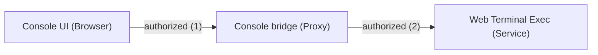
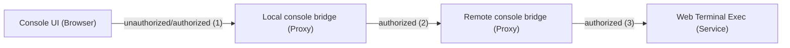
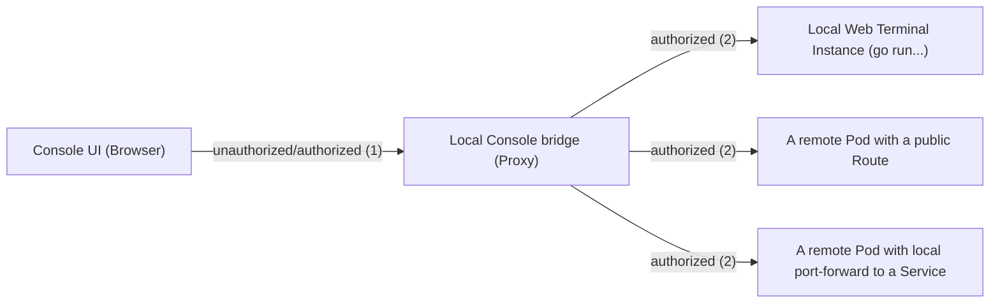

# Web terminal proxy

This module provides a HTTP proxy to communicate with the
[Web Terminal Operator](https://github.com/redhat-developer/web-terminal-operator),
or to be more exact, with a
[Web Terminal Exec](https://github.com/redhat-developer/web-terminal-exec) `Pod`.

This `Pod` is available via a `Service` and is managed together with other resources by the
[Dev Workspace Operator](https://github.com/devfile/devworkspace-operator),
and instantiated for each `DevWorkspace` (see also: 
[Go API](https://github.com/devfile/api/blob/main/pkg/apis/workspaces/v1alpha1/devworkspace_types.go) and
[CRD](https://github.com/devfile/api/blob/9057a5da58d20d5b2aee746df4b8fa7ea25ea2bc/crds/workspace.devfile.io_devworkspaces.yaml)).

<br/>

## Creating and deleting a `DevWorkspace` / web terminal

Both operations are handled with the standard k8s API.

This communication is also proxied by the console bridge, but the `terminal` module isn't involved here.

<br/>

## Open a web terminal (*in-cluster*, default in production)

Everytime when a user opens a web terminal the UI communicates with the `terminal` module with this endpoints:

* `/api/terminal/available/`
* `/api/terminal/proxy/:namespace/:devworkspace-name/exec/init`
* `/api/terminal/proxy/:namespace/:devworkspace-name/activity/tick`

All these API calls checks first the status of the Web Terminal Operator and the `DevWorkspace` status.

<br/>

Because the `DevWorkspace` `Pod` is only available via an ***in cluster / internal*** `Service` it's required
that the console bridge proxies all http requests from the UI to the `Exec` `Pod`.



1. The web console UI (or the browser) communicates with the web console backend (the bridge) that proxies this communication.
   * The user authentication happens with the `console-session-token` **Cookie**.
   * All bridge calls requires a valid `csrf-token`, an equal `X-CSRFToken` header and an `Origin` header.
2. A new http request is send directly from the in-cluster bridge to the Web Terminal Exec `Service`/`Pod`
   * The Service hostname is similar to `workspace${randomHexId}-service.test.svc.cluster.local` and can be only accessed within the cluster.
   * This pod uses (only) the `X-Access-Token` or `X-Forwarded-Access-Token` header for the user authentication.
   * The first one would remove a `"Bearer "` prefix, see Web Terminal Exec [token.go](https://github.com/redhat-developer/web-terminal-exec/blob/v1.7.0/pkg/auth/token.go).
   * The new requests are created in `proxy.go` `handleExecInit` and `handleActivity`.

## Local development (*off-cluster*, reuse a `remote-console`)

When running the console bridge ***off-cluster*** (with or without authentification) it isn't
possible to communicate directly with the internal Web Terminal Exec (`Service`/`Pod`).

The simpliest and pre-configured way (see `./contrib/oc-environment.sh`) is to use a console
that is installed on a cluster-bot or shared cluster.



1. The browser sends the requests to the **local console**
   * It can use a static user token (local console authentification is disabled) or a login provider.
2. All terminal specific API calls (see list above) are then proxied to the **"remote console"**.
   * A **user token** is **always** transfered with the with the `console-session-token` Cookie.
   * It uses the static user token if the bridge is started with disabled authentification!
   * The request path wasn't changed: An incoming request like `/api/terminal/proxy/:namespace/:devworkspace-name/exec/init` was unchanged pass-through to the remote console.
3. The remote console proxies these calls again.
   * Same in-cluster implementation as above.

To use this configuration these two environment variables are required,
and both are automatically set when you run `source ./contrib/oc-environment.sh`!

```sh
export BRIDGE_K8S_MODE_OFF_CLUSTER_TERMINAL_PROXY_MODE=remote-console
export BRIDGE_K8S_MODE_OFF_CLUSTER_TERMINAL_PROXY_URL=https://console-openshift-console.apps-crc.testing
```

## Local development (*off-cluster*, use a `local-operator`)

While the default console bridge proxy works only in-cluster, and the remote-bridge proxy forwards all
network calls mostly unchanged from the browser to the remote bridge.

But to develop and debug a local Web Terminal Exec instance the console can also proxy the API calls
and send them to a local port. This port can be a local Web Terminal instance (`go run ...`) or a
`kubectl port-forward` to a specific `Service`.



1. (Same as before:) The browser sends the requests to the **local console**
   * It can use a static user token (local console authentification is disabled) or a login provider.
2. All terminal specific API calls (see list above) are then proxied to the (local) **"Web Terminal Exec Endpoint/URL"**.
   * A **user token** is **always** transfered as `X-Forwarded-Access-Token`, not as cookie.
   * The request path is updated: An incoming request like `/api/terminal/proxy/:namespace/:devworkspace-name/exec/init` will call `/exec/init`, etc.

To forward the port manually run:

```sh
oc -n openshift-terminal get services
oc -n openshift-terminal port-forward service/workspace-ABCDEF...-service 4444
```

```sh
source ./contrib/oc-environment.sh

export BRIDGE_K8S_MODE_OFF_CLUSTER_TERMINAL_PROXY_MODE=local-operator
export BRIDGE_K8S_MODE_OFF_CLUSTER_TERMINAL_PROXY_URL=http://localhost:4444

./bin/bridge
```
