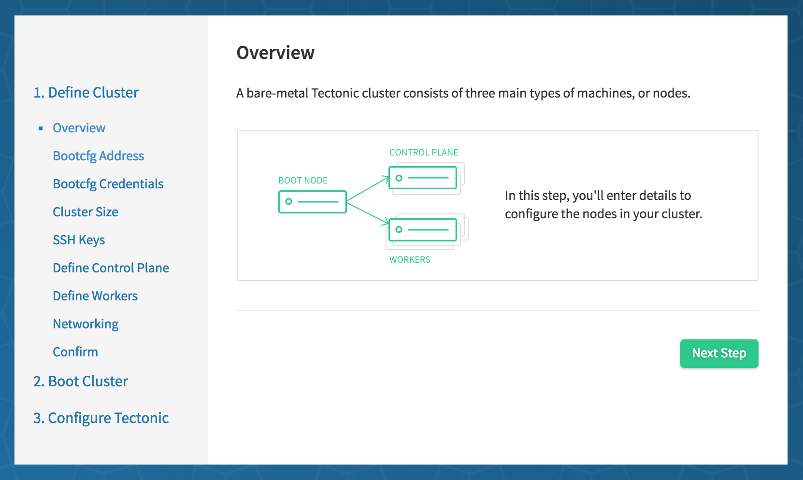
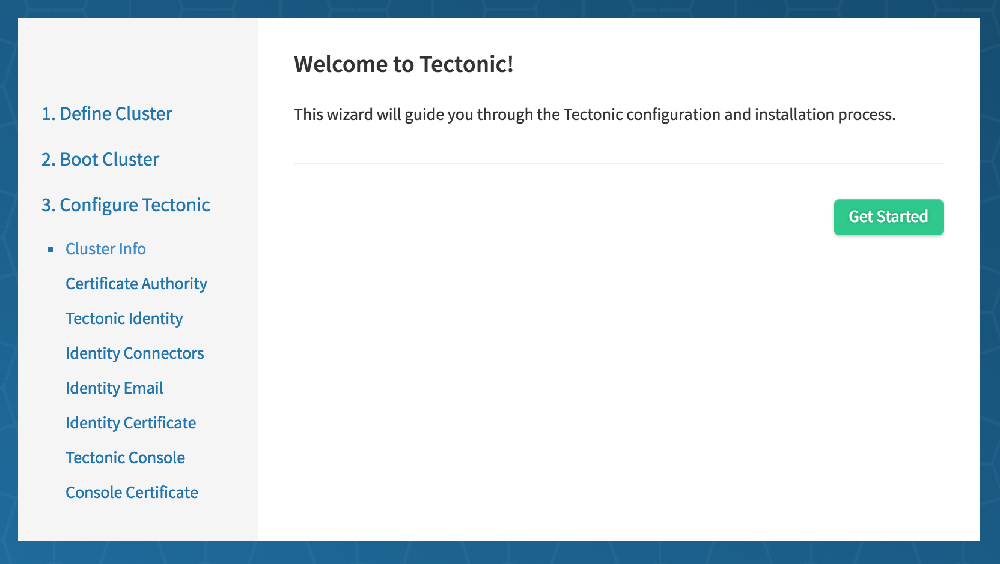

This guide walks through a bare-metal installation of Tectonic utilizing PXE-based tools. This document will cover:

| Step | Description |
|------|-------------|
| [1. Overview][step-1] | Review types of machines in the cluster<br/>Review networking requirements |
| [2. Provisioning Infrastructure][step-2] | Download, install and configure bootcfg<br/>Generate TLS assets |
| [3. Configure Networking][step-3] | Set up DHCP, TFTP, and DNS services<br/>Configure DNS for the cluster |
| [4. Tectonic Installer][step-4] | Install Kubernetes |
| [5. Tectonic Wizard][step-5] | Set up cluster-wide SSO<br/>Deploy the Tectonic Console |
| [6. Tectonic Console][step-6] | You're done! Start inviting your users to use your new cluster |

[step-1]: #1-overview
[step-2]: #2-provisioning-infrastructure
[step-3]: #3-networking
[step-4]: #4-tectonic-installer
[step-5]: #5-tectonic-wizard
[step-6]: #6-tectonic-console

## 1. Overview

### Node Types

A minimum of 3 machines is required to run Tectonic. A bare-metal Tectonic cluster consists of three main types of nodes:

**Provisioner Node**

The provisioner node runs the network boot and provisioning service (bootcfg) and PXE services if you don't already run them elsewhere. You may use CoreOS or any Linux distribution for this node. This node needs to be up and running to provision nodes, but won’t join Tectonic clusters.

**Controller Nodes**

These nodes run the control plane of the cluster. These services will be highly available and will execute automatic leader election should a node fail. These nodes will have their own trust zone since they are critical to the cluster. CoreOS will be installed to disk upon boot.

**Worker Nodes**

These nodes run your applications. New worker nodes will join the cluster by talking to the controller nodes for admission. CoreOS will be installed to disk upon boot.

### Networking Requirements

This guide requires familiarity with PXE booting, the ability to configure network services, and to add DNS names. These are walked through in detail below.

## 2. Provisioning Infrastructure

### Download Latest Release

Download the [latest Tectonic release](https://github.com/coreos-inc/tectonic/releases) and extract it on the provisioner node.

```sh
tar xzvf tectonic-VERSION.tar.gz
```

### bootcfg

`bootcfg` is a service for network booting and provisioning bare-metal nodes into CoreOS clusters. `bootcfg` should be installed on a provisioner node to serve configs for the nodes being PXE booted and provisioned.

The commands to set up `bootcfg` should be performed on the provisioner node.

```sh
cd tectonic/coreos-baremetal
```

#### Generate TLS Credentials

The `bootcfg` API allows client tools such as the Tectonic Bootstrap graphical installer to manage how machines are provisioned. TLS encryption is used for connections and client's are authenticated with a client certificate.

Generate a self-signed `ca.crt`, a server certificate  (`server.crt`, `server.key`), and client credentials (`client.crt`, `client.key`) with `scripts/tls/cert-gen`. Export the DNS name or IP (discouraged) of the provisioner host where `bootcfg` will be accessed.


```sh
$ cd scripts/tls
# DNS or IP Subject Alt Names where bootcfg can be reached
$ export SAN=DNS.1:bootcfg.example.com,IP.1:192.168.1.42
$ ./cert-gen
```

Place the TLS credentials in the default location:

```sh
$ sudo mkdir -p /etc/bootcfg
$ sudo cp ca.crt server.crt server.key /etc/bootcfg/
```

The `client.crt`, `client.key`, and `ca.crt` will be used by the Tectonic Bootstrap graphical client later.

#### Install

A pre-built `bootcfg` binary is available for general Linux distributions.

#### Binary

Copy the `bootcfg` static binary to an appropriate location on the provisioner node.

```sh
$ cd tectonic/coreos-baremetal
$ sudo cp bootcfg /usr/local/bin
```

#### Set Up User/Group

The `bootcfg` service should be run by a non-root user with access to the `bootcfg` data directory (`/var/lib/bootcfg`). Create a `bootcfg` user and group.

```sh
$ sudo useradd -U bootcfg
$ sudo mkdir -p /var/lib/bootcfg/assets
$ sudo chown -R bootcfg:bootcfg /var/lib/bootcfg
```

#### Create systemd Service

Copy the provided `bootcfg` systemd unit file.

```sh
sudo cp contrib/systemd/bootcfg.service /etc/systemd/system/
sudo systemctl daemon-reload
```

The example unit exposes the `bootcfg` HTTP config endpoints for nodes on port **8080** and exposes (e.g. to graphical clients) the RPC API on port **8081**. Customize the port settings to suit your preferences and be sure to allow your choices within the host's firewall so clients can access the services.

### Start bootcfg

Start the `bootcfg` service and enable it if you'd like it to start on every boot (you probably do!).

```sh
$ sudo systemctl enable bootcfg.service
$ sudo systemctl start bootcfg.service
```

### Verify


Verify the bootcfg service can be reached by nodes (those being provisioned). It is recommended that you define an DNS name for this purpose (see [Networking](#networking)).

```sh
$ dig bootcfg.example.com
```

Verify you receive a response from the HTTP and API endpoints. All of the following responses are expected:

```sh
$ curl http://bootcfg.example.com:8080
bootcfg

$ openssl s_client -connect bootcfg.example.com:8081 -CAfile /etc/bootcfg/ca.crt -cert client.crt -key client.key
CONNECTED(00000003)
depth=1 CN = fake-ca
verify return:1
depth=0 CN = fake-server
verify return:1
---
Certificate chain
 0 s:/CN=fake-server
   i:/CN=fake-ca
---
....
```

### Download CoreOS

Tectonic Bootstrap creates a cluster which fetches CoreOS images from the `bootcfg` image assets to reduce bandwidth usage and increase the speed of CoreOS PXE boots and installs to disk. Currently, this **requires** the CoreOS Beta 1081.5.0 image to get started.

```sh
$ cd coreos-baremetal/scripts
$ ./get-coreos beta 1081.5.0 .     # note the "." 3rd argument
```

Move the images to `/var/lib/bootcfg/assets`,

```sh
$ sudo cp -r coreos /var/lib/bootcfg/assets
```

```
/var/lib/bootcfg/assets/
├── coreos
│   └── 1081.5.0
│       ├── CoreOS_Image_Signing_Key.asc
│       ├── coreos_production_image.bin.bz2
│       ├── coreos_production_image.bin.bz2.sig
│       ├── coreos_production_pxe_image.cpio.gz
│       ├── coreos_production_pxe_image.cpio.gz.sig
│       ├── coreos_production_pxe.vmlinuz
│       └── coreos_production_pxe.vmlinuz.sig
```

and verify the images are acessible.

```
$ curl http://bootcfg.example.com:8080/assets/coreos/1081.5.0/
<pre>...
```

## 3. Networking

A bare-metal Tectoinc cluster requires PXE infrastructure, which we'll setup next.

### Set up DHCP, TFTP, and DNS services

Review [network setup](https://github.com/coreos/coreos-baremetal/blob/master/Documentation/network-setup.md) with your network administrator to set up DHCP, TFTP, and DNS services on your network, if it has not already been done. At a high level, your goals are to:

* Chainload PXE firmwares to iPXE
* Point iPXE client machines to the `bootcfg` iPXE HTTP endpoint `http://bootcfg.example.com:8080/boot.ipxe`

A simple approach (which may be suitable) is to run a proxy DHCP service and TFTP with dnsmasq, alongside an existing DHCP server. You'd add a dnsmasq configuration, prepare `/var/lib/tftpboot`, and configure the firewall.

#### Example /etc/dnsmasq.d/dhcp-proxy.conf

```
dhcp-range=192.168.1.1,proxy,255.255.255.0
enable-tftp
tftp-root=/var/lib/tftpboot
pxe-service=tag:#ipxe,x86PC,"PXE chainload to iPXE",undionly.kpxe
dhcp-userclass=set:ipxe,iPXE
pxe-service=tag:ipxe,x86PC,"iPXE",http://bootcfg.example.com:8080/boot.ipxe
log-queries
log-dhcp
```

CoreOS provides [dnsmasq](https://github.com/coreos/coreos-baremetal/tree/master/contrib/dnsmasq) as `quay.io/coreos/dnsmasq`, if you wish to use rkt or Docker.

### DNS

Add DNS names:

* `bootcfg.example.com` resolves to your `bootcfg` deployment
* `console.example.com` resolves to any one of the machines which will be part of the Tectonic cluster.

## 4. Tectonic Installer

Tectonic Installer is a graphical application you can run on your laptop to create a Tectonic cluster. It authenticates to `bootcfg` via its API.

### Requirements

Your laptop running the Tectonic installer app must be able to access your `bootcfg` instance. You will need the `client.crt` and `client.key` credentials created when setting up `bootcfg` to complete the flow as well as the `ca.crt`.

Download the [latest Tectonic release](https://releases.tectonic.com/tectonic-v1.3.0.tar.gz) and extract it on your laptop.

```sh
tar xzvf tectonic-VERSION.tar.gz
```

### Run Tectonic Bootstrap

On your laptop, launch the Tectonic Bootstrap graphical installer that matches your platform (`linux`, `darwin`, `windows`):

```sh
$ cd tectonic/tectonic-installer/linux
$ ./bootstrap
```



Jump over to the installer and complete the steps. You will need to enter machine MAC addresses, desired IP addresses, and an SSH public key to access your machines.

At the beginning, your machines should be off. Halfway through the install process, the machines will be powered on via IPMI or by pressing the power button.

## 5. Tectonic Wizard

The Tectonic Wizard is a tool that helps install Tectonic and is already running in your cluster.



Go through the Tectonic Wizard to configure Tectonic components, such as cluster-wide SSO, Tectonic Identity, and the user interface, Tectonic Console.

Contact Tectonic support if you have questions.

## 6. Tectonic Console

After the Wizard is complete, your cluster is ready to use. Follow the onscreen instructions to access Tectonic Console.

You are ready to deploy your first application on to the cluster!


